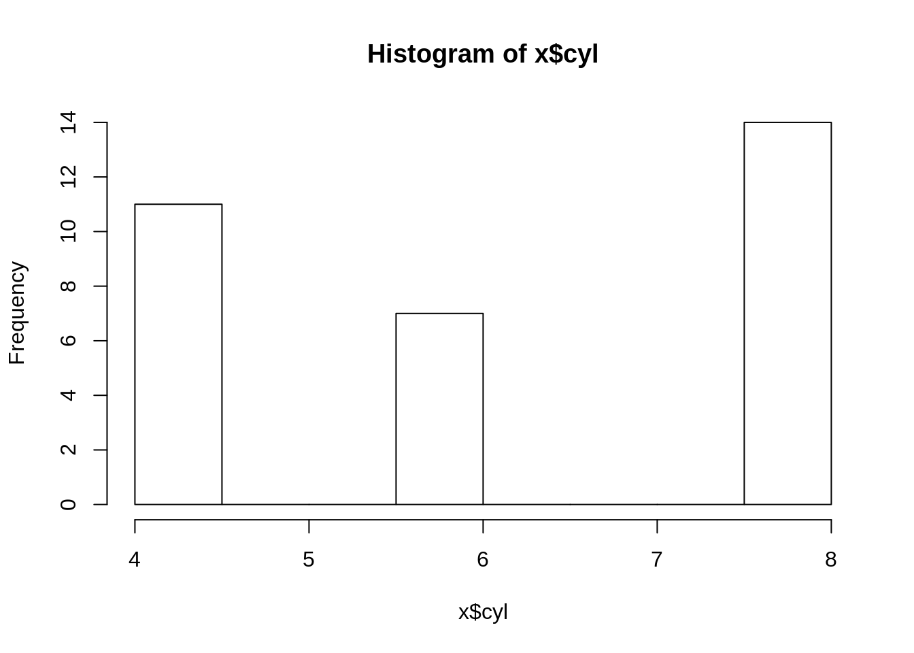
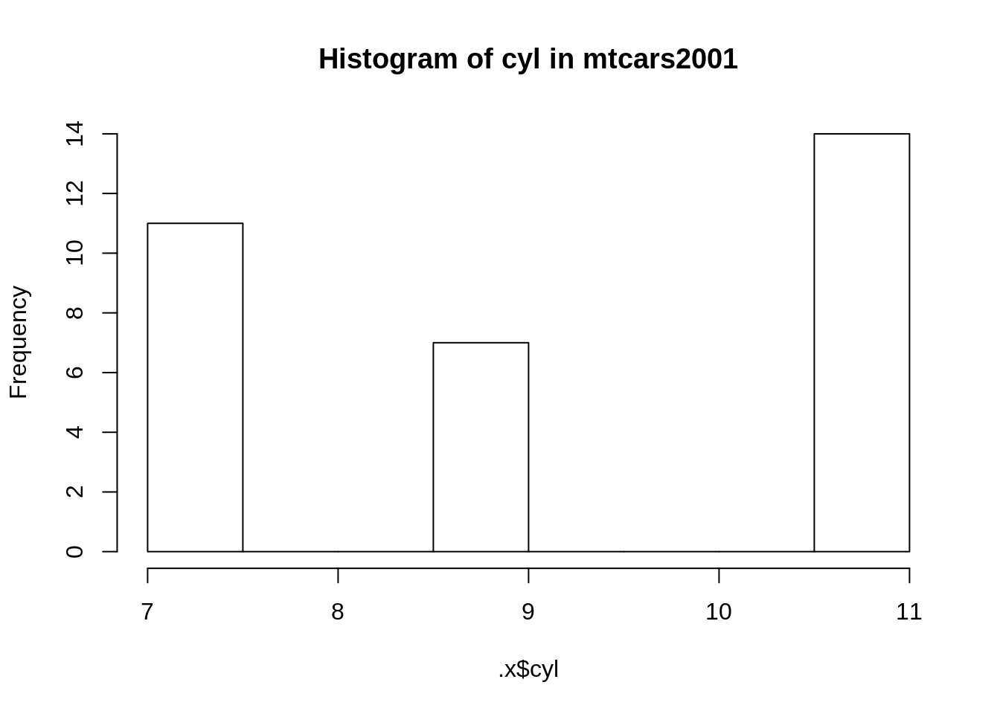

# Chapter 3 Functional Programming

## 3.1 Introduction

### 3.1.1 Function definitions

As mentioned in the [functional programming
overview](#funcprog_overview) functional programming is one of the
numerous ways to write code. In functional programming, you write
functions that do the computations and then as the user, you call these
functions to work for you.

You should be familiar with function definitions in R. For example,
suppose you want to compute the square root of a number and want to do
so using Newton's algorithm:

``` sourceCode r
sqrt_newton <- function(a, init, eps = 0.01){
    while(abs(init**2 - a) > eps){
        init <- 1/2 *(init + a/init)
    }
    return(init)
}
```

You can then use this function to get the square root of a number:

``` sourceCode r
sqrt_newton(16, 2)
```

    ## [1] 4.00122

We are using a `while` loop inside the body. The *body* of a function
are the instructions that define the function. You can get the body of a
function with `body(some_func)`\] of the function. In *pure* functional
programming languages, like Haskell, you don't have loops. How can you
program without loops, you may ask? In functional programming, loops are
replaced by recursion. Let's rewrite our little example above with
recursion:

``` sourceCode r
sqrt_newton_recur <- function(a, init, eps = 0.01){
    if(abs(init**2 - a) < eps){
        result <- init
    } else {
        init <- 1/2 * (init + a/init)
        result <- sqrt_newton_recur(a, init, eps)
    }
    return(result)
}
```

``` sourceCode r
sqrt_newton_recur(16, 2)
```

    ## [1] 4.00122

R is not a pure functional programming language though, so we can still
use loops (be it `while` or `for` loops) in the bodies of our functions.
Actually, for R specifically, it is better, performance-wise, to use
loops instead of recursion, because R is not tail-call optimized. I
won't got into the details of what tail-call optimization is but just
remember that if performance is important a loop will be faster.
However, sometimes, it is easier to write a function using recursion. I
personally tend to avoid loops if performance is not important, because
I find that code that avoids loops is easier to read and debug. However,
knowing that you have can use loops is reassuring. In the coming
sections I will show you some built-in function that make it possible to
avoid writing loops and that don't rely on recursion, so performance
won't be penalized.

### 3.1.2 Properties of functions

Mathematical functions have a nice property: we always get the same
output for a given input. This is called referential transparency and we
should aim to write our R functions in such a way.

For example, the following function:

``` sourceCode r
increment <- function(x){
    return(x + 1)
}
```

Is a referential transparent function. We always get the same result for
any `x` that we give to this function.

This:

``` sourceCode r
increment(10)
```

    ## [1] 11

will always produce `11`.

However, this one:

``` sourceCode r
increment_opaque <- function(x){
    return(x + spam)
}
```

is not a referential transparent function, because its value depends on
the global variable `spam`.

``` sourceCode r
spam <- 1

increment_opaque(10)
```

    ## [1] 11

will only produce `11` if `spam = 1`. But what if `spam = 19`?

``` sourceCode r
spam <- 19

increment_opaque(10)
```

    ## [1] 29

To make `increment_opaque()` a referential transparent function, it is
enough to make `spam` an argument:

``` sourceCode r
increment_not_opaque <- function(x, spam){
    return(x + spam)
}
```

Now even if there is a global variable called `spam`, this will not
influence our function:

``` sourceCode r
spam <- 19

increment_not_opaque(10, 34)
```

    ## [1] 44

This is because the variable `spam` defined in the body of the function
is a local variable. It could have been called anything else, really.
Avoiding opaque functions makes our life easier.

Another property that adepts of functional programming value is that
functions should have no, or very limited, side-effects. This means that
functions should not change the state of your program.

For example this function (which is not a referential transparent
function):

``` sourceCode r
count_iter <- 0

sqrt_newton_side_effect <- function(a, init, eps = 0.01){
    while(abs(init**2 - a) > eps){
        init <- 1/2 *(init + a/init)
        count_iter <<- count_iter + 1 # The "<<-" symbol means that we assign the
    }                                 # RHS value in a variable in the global environment
    return(init)
}
```

If you look in the environment pane, you will see that `count_iter`
equals 0. Now call this function with the following arguments:

``` sourceCode r
sqrt_newton_side_effect(16000, 2)
```

    ## [1] 126.4911

``` sourceCode r
print(count_iter)
```

    ## [1] 9

If you check the value of `count_iter` now, you will see that it
increased\! This is a side effect, because the function changed
something outside its scope. It changed a value in the global
environment. In general, it is good practice to avoid side-effects. For
example, we could make the above function not have any side effects like
this:

``` sourceCode r
sqrt_newton_count <- function(a, init, count_iter = 0, eps = 0.01){
    while(abs(init**2 - a) > eps){
        init <- 1/2 *(init + a/init)
        count_iter <- count_iter + 1
    }
    return(c(init, count_iter))
}
```

Now, this function returns a list with two elements, the result, and the
number of iterations it took to get the result:

``` sourceCode r
sqrt_newton_count(16000, 2)
```

    ## [1] 126.4911   9.0000

Writing to disk is also considered a side effect, because the function
changes something (a file) outside its scope. But this cannot be avoided
(and it's actually a good thing to have, functions that can write to
disk) so just remember: try to avoid having functions changing variables
in the global environment unless you have a very good reason of doing
so.

Finally, another property of mathematical functions, is that they do one
single thing. Functional programming purists also program their
functions to do one single task. This has benefits, but can complicate
things. The function we wrote previously does two things: it computes
the square root of a number and also returns the number of iterations it
took to compute the result. However, this is not a bad thing; the
function is doing two tasks, but these tasks are related to each other
and it makes sense to have them together. My piece of advice: avoid
having functions that do too many *unrelated* things. This makes
debugging harder.

In conclusion: you should strive for referential transparency, try to
avoid side effects unless you have a good reason to have them and try to
keep your functions short and do as little tasks as possible. This makes
testing and debugging easier, as you will see.

## 3.2 Mapping and Reducing: the *base* way

No introduction to functional programming would be complete without some
discussion about the functions `Map()` (and the associated `*apply()`
family of functions) and `Reduce()`. `Map()` allows you to map your
function to every element of a list of arguments and is easy to
understand, while `Reduce()` (sometimes called `fold()` in other
programming languages) *reduces* a list of values to a single value by
successively applying a function. It's a bit harder to understand, but
with some examples it will become clear soon enough. In this section we
will focus on how to do things using `base` functions. In the next
section we will take a look at the `purrr` package which extends R's
functional programming capabilities tremendously.

### 3.2.1 Mapping with `Map()` and the `*apply()` family of functions

Now that we have our nice function that computes square roots using
Newton's algorithm, we would like to compute the square root of every
element in the following list:

``` sourceCode r
numbers <- c(16, 25, 36, 49, 64, 81)

sqrt_newton(numbers, init = rep(1, 6), eps = rep(0.001, 6))
```

    ## Warning in while (abs(init^2 - a) > eps) {: the condition has length > 1
    ## and only the first element will be used
    
    ## Warning in while (abs(init^2 - a) > eps) {: the condition has length > 1
    ## and only the first element will be used
    
    ## Warning in while (abs(init^2 - a) > eps) {: the condition has length > 1
    ## and only the first element will be used
    
    ## Warning in while (abs(init^2 - a) > eps) {: the condition has length > 1
    ## and only the first element will be used
    
    ## Warning in while (abs(init^2 - a) > eps) {: the condition has length > 1
    ## and only the first element will be used
    
    ## Warning in while (abs(init^2 - a) > eps) {: the condition has length > 1
    ## and only the first element will be used

    ## [1] 4.000001 5.000023 6.000253 7.001406 8.005148 9.014272

We get a whole bunch of nasty warning messages, but we do get the
expected result. But you should not leave it like this. Who knows what
may happen some time down the road, when you try to compose this
function with another? Maybe you'll get an error and you won't
understand why\! Let's rewrite the function properly.

We get these warnings because the condition `(init^2 - a) > eps` does
not make sense for vectors. Here, R tells the user that it only uses the
first element and then does the computation anyways. I would prefer if R
would stop the execution and print an error message. This would force
the user to have to rewrite the function to explicitly take vectors into
account. And there is a very simple way of doing it, by using the
function `Map()`:

``` sourceCode r
Map(sqrt_newton, numbers, init = 1)
```

    ## [[1]]
    ## [1] 4.000001
    ## 
    ## [[2]]
    ## [1] 5.000023
    ## 
    ## [[3]]
    ## [1] 6.000253
    ## 
    ## [[4]]
    ## [1] 7
    ## 
    ## [[5]]
    ## [1] 8.000002
    ## 
    ## [[6]]
    ## [1] 9.000011

`Map()` applies a function to every element of a list and returns a
list.

We could then write a wrapper around `Map()`:

``` sourceCode r
sqrt_newton_vec <- function(numbers, init, eps = 0.01){
    return(Map(sqrt_newton, numbers, init, eps))
}

sqrt_newton_vec(numbers, 1)
```

    ## [[1]]
    ## [1] 4.000001
    ## 
    ## [[2]]
    ## [1] 5.000023
    ## 
    ## [[3]]
    ## [1] 6.000253
    ## 
    ## [[4]]
    ## [1] 7
    ## 
    ## [[5]]
    ## [1] 8.000002
    ## 
    ## [[6]]
    ## [1] 9.000011

As you can see, we can give a function as an argument to another
function. This makes `Map()` a *higher-order function*. Higher-order
functions are functions that take other functions as arguments and
return either another function, or a value. This is another important
concept in functional programming and encourages modularity. It makes
your code easily reusable\!

R has other higher-order functions that work like `Map()`, such as
`apply(), lapply(), mapply(), sapply(), vapply()` and `tapply()`.
Depending on what you want to do, you will have to use one or the other.
`apply()` and ‘tapply()' are different from the other `*apply()`
functions, because they work on arrays. You can apply a function on the
rows or columns of an array, for example if you want a row-wise sum:

``` sourceCode r
a <- cbind(c(1, 2, 3), c(4, 5, 6), c(7, 8, 9))
apply(a, 1, sum)
```

    ## [1] 12 15 18

We could use `lapply()` instead of `Map()`:

``` sourceCode r
lapply(numbers, sqrt_newton, init = 1)
```

    ## [[1]]
    ## [1] 4.000001
    ## 
    ## [[2]]
    ## [1] 5.000023
    ## 
    ## [[3]]
    ## [1] 6.000253
    ## 
    ## [[4]]
    ## [1] 7
    ## 
    ## [[5]]
    ## [1] 8.000002
    ## 
    ## [[6]]
    ## [1] 9.000011

or `sapply()`:

``` sourceCode r
sapply(numbers, sqrt_newton, init = 1)
```

    ## [1] 4.000001 5.000023 6.000253 7.000000 8.000002 9.000011

We could rewrite `sqrt_newton_vec()` with `sapply()` which would return
a better looking result (a list of numbers instead of a list of lists):

``` sourceCode r
sqrt_newton_vec <- function(numbers, init, eps = 0.01){
    return(sapply(numbers, sqrt_newton, init, eps))
}

sqrt_newton_vec(numbers, 1)
```

    ## [1] 4.000001 5.000023 6.000253 7.000000 8.000002 9.000011

`mapply()` is different from these two:

``` sourceCode r
inits <- c(100, 20, 3212, 487, 5, 9888)
mapply(sqrt_newton, numbers, init = inits)
```

    ## [1] 4.000284 5.000001 6.000003 7.000006 8.000129 9.000006

What happens here is that `sqrt_newton()` gets called with following
arguments:

``` sourceCode r
sqrt_newton(numbers[1], inits[1])
```

    ## [1] 4.000284

``` sourceCode r
sqrt_newton(numbers[2], inits[2])
```

    ## [1] 5.000001

``` sourceCode r
sqrt_newton(numbers[3], inits[3])
```

    ## [1] 6.000003

``` sourceCode r
sqrt_newton(numbers[4], inits[4])
```

    ## [1] 7.000006

``` sourceCode r
sqrt_newton(numbers[5], inits[5])
```

    ## [1] 8.000129

``` sourceCode r
sqrt_newton(numbers[6], inits[6])
```

    ## [1] 9.000006

From the `Map()`'s documentation, we learn
    that:

    `Map()` is wrapper to `mapply()` which does not attempt to simplify the result...

All this behaviour can be replicated using loops, but once you get the
gist of these functions, you can write code that is shorter and easier
to read and unlike in the case of recursion, without any loss in
performance (but without any gains either).

### 3.2.2 `Reduce()`

`Reduce()` is another very useful higher-order function, especially if
you want to avoid loops to make your code easier to read. In some
programming languages, `Reduce()` is called `fold()`.

I think that the following example illustrates the power of `Reduce()`
well:

``` sourceCode r
Reduce(`+`, numbers, init = 0)
```

    ## [1] 271

Can you guess what happens? `Reduce()` takes a function as an argument,
here the function `+`[<sup>1</sup>](#fn1) and then does the following
computation:

    0 + numbers[1] + numbers[2] + numbers[3]...

It applies the user supplied function successively but has to start with
something, so we give it the argument `init` also. This argument is
actually optional, but I show it here because in some cases it might be
useful to start the computations at another value than `0`. This
function generalizes functions that only take two arguments. If you were
to write a function that returns the minimum between two numbers:

``` sourceCode r
my_min <- function(a, b){
    if(a < b){
        return(a)
    } else {
        return(b)
    }
}
```

You could use `Reduce()` to get the minimum of a list of numbers:

``` sourceCode r
print(numbers)
```

    ## [1] 16 25 36 49 64 81

``` sourceCode r
Reduce(my_min, numbers)
```

    ## [1] 16

Here we don't supply an `init` because there is no need for it. Of
course R's built-in `min()` function works on a list of values. But
`Reduce()` is a very powerful function that can make our life much
easier and most importantly avoid writing clumsy loops.

## 3.3 Mapping and Reducing: the `purrr` way

Hadley Wickham developed a package called `purrr` which contains a lot
of very useful functions. I will show some of them here, but in the next
chapter, we are going to study `purrr` in greater depth. Also, take the
time to read `purrr`'s documentation, and of course you can read more
about `purrr` in Wickham and Grolemund ([2016](#ref-wickham2016)).

### 3.3.1 The `map*()` family of functions

In the previous section we saw how to map a function to each element of
a list. Each version of an `*apply()` function has a different purpose,
but it is not very easy to remember which one returns a list, which
other one returns an atomic vector and so on. If you're working on data
frames you can use `apply()` to sum (for example) over columns or rows,
because you can specify which `MARGIN` you want to sum over. But you do
not get a data frame back. In the `purrr` package, each of the functions
that do mapping have a similar name. The first part of these functions'
names all start with `map_` and the second part tells you what this
function is going to output. For example, if you want `double`s out, you
would use `map_dbl()`. If you are working on data frames want a data
frame back, you would use `map_df()`. These are much more intuitive and
easier to remember and we're going to learn how to use them in the
chapter about [The Tidyverse](tidyverse.html#tidyverse). For now, let's
just focus on the basic functions, `map()` and `reduce()` (and some
variants of `reduce()`). To map a function to every element of a list,
simply use `map()`:

``` sourceCode r
library("purrr")
map(numbers, sqrt_newton, init = 1)
```

    ## [[1]]
    ## [1] 4.000001
    ## 
    ## [[2]]
    ## [1] 5.000023
    ## 
    ## [[3]]
    ## [1] 6.000253
    ## 
    ## [[4]]
    ## [1] 7
    ## 
    ## [[5]]
    ## [1] 8.000002
    ## 
    ## [[6]]
    ## [1] 9.000011

Compared to `Map()`, the function and the list are given in the reverse
order, but the result is the same, of course.

### 3.3.2 Reducing with `purrr`

In the `purrr` package, you can find two more functions for folding:
`reduce()` and `reduce_right()`. The difference between `reduce()` and
`reduce_right()` is pretty obvious: `reduce_right()` starts from the
right\!

``` sourceCode r
a <- seq(1, 10)

reduce(a, `-`)
```

    ## [1] -53

``` sourceCode r
reduce_right(a, `-`)
```

    ## [1] -35

For operations that are not commutative, this makes a difference. Other
interesting folding functions are `accumulate()` and
`accumulate_right()`:

``` sourceCode r
a <- seq(1, 10)

accumulate(a, `-`)
```

    ##  [1]   1  -1  -4  -8 -13 -19 -26 -34 -43 -53

``` sourceCode r
accumulate_right(a, `-`)
```

    ##  [1] -35 -34 -32 -29 -25 -20 -14  -7   1  10

These two functions keep the intermediary results.

## 3.4 Basic anonymous functions

One last very useful concept are anonymous functions. Suppose that you
want to apply one of your own functions to a list of datasets. For
instance, you want to have a histogram of a variable that is called the
same accross a list of datasets. Maybe your datasets are yearly surveys
and each year the survey was conducted is another `.csv` file. For
illustration purposes, let us use the `mtcars` dataset with some minor
changes:

``` sourceCode r
data(mtcars)

mtcars2000 <- mtcars
mtcars2001 <- mtcars
mtcars2001$cyl <- mtcars2001$cyl+3
datasets <- list("mtcars2000" = mtcars2000,
"mtcars2001" = mtcars2001)
```

In the next chapters we will learn how to load a lot of datasets at once
and store them in a list. So it is important to know how to work with
datasets that are stored on lists. Now suppose you want to use
`purrr::map()` to plot a histogram of variable `cyl` for each dataset
that is contained in your list.

``` sourceCode r
map(datasets, hist, cyl)
```

``` sourceCode r
Error in hist.default(.x[[i]], ...) : 'x' must be numeric
```

Maybe try this:

``` sourceCode r
map(datasets, hist(cyl))
```

``` sourceCode r
Error in hist(cyl) : object 'cyl' not found
```

So how can we solve this issue? One way is to use an anonymous function.
Anonymous functions are functions that get declared on the fly and do
not have names. These are especially useful inside higher order
functions such as
`purrr::map()`:

``` sourceCode r
map(datasets, (function(x) hist(x$cyl)))
```



    ## $mtcars2000
    ## $breaks
    ## [1] 4.0 4.5 5.0 5.5 6.0 6.5 7.0 7.5 8.0
    ## 
    ## $counts
    ## [1] 11  0  0  7  0  0  0 14
    ## 
    ## $density
    ## [1] 0.6875 0.0000 0.0000 0.4375 0.0000 0.0000 0.0000 0.8750
    ## 
    ## $mids
    ## [1] 4.25 4.75 5.25 5.75 6.25 6.75 7.25 7.75
    ## 
    ## $xname
    ## [1] "x$cyl"
    ## 
    ## $equidist
    ## [1] TRUE
    ## 
    ## attr(,"class")
    ## [1] "histogram"
    ## 
    ## $mtcars2001
    ## $breaks
    ## [1]  7.0  7.5  8.0  8.5  9.0  9.5 10.0 10.5 11.0
    ## 
    ## $counts
    ## [1] 11  0  0  7  0  0  0 14
    ## 
    ## $density
    ## [1] 0.6875 0.0000 0.0000 0.4375 0.0000 0.0000 0.0000 0.8750
    ## 
    ## $mids
    ## [1]  7.25  7.75  8.25  8.75  9.25  9.75 10.25 10.75
    ## 
    ## $xname
    ## [1] "x$cyl"
    ## 
    ## $equidist
    ## [1] TRUE
    ## 
    ## attr(,"class")
    ## [1] "histogram"

Here the function is enclosed between `()` and is not named. The
function has a single argument `x`, which is supposed to be a dataset.
We then plot a histogram of the variable `cyl` from this dataset. Then
this function is mapped to every dataset contained in the list
`datasets` that we created above.

We can also write anonymous functions that are more complex:

``` sourceCode r
map2(
.x = datasets, .y = names(datasets),
(function(.x, .y) hist(.x$cyl, main=paste("Histogram of cyl in", .y)))
)
```



    ## $mtcars2000
    ## $breaks
    ## [1] 4.0 4.5 5.0 5.5 6.0 6.5 7.0 7.5 8.0
    ## 
    ## $counts
    ## [1] 11  0  0  7  0  0  0 14
    ## 
    ## $density
    ## [1] 0.6875 0.0000 0.0000 0.4375 0.0000 0.0000 0.0000 0.8750
    ## 
    ## $mids
    ## [1] 4.25 4.75 5.25 5.75 6.25 6.75 7.25 7.75
    ## 
    ## $xname
    ## [1] ".x$cyl"
    ## 
    ## $equidist
    ## [1] TRUE
    ## 
    ## attr(,"class")
    ## [1] "histogram"
    ## 
    ## $mtcars2001
    ## $breaks
    ## [1]  7.0  7.5  8.0  8.5  9.0  9.5 10.0 10.5 11.0
    ## 
    ## $counts
    ## [1] 11  0  0  7  0  0  0 14
    ## 
    ## $density
    ## [1] 0.6875 0.0000 0.0000 0.4375 0.0000 0.0000 0.0000 0.8750
    ## 
    ## $mids
    ## [1]  7.25  7.75  8.25  8.75  9.25  9.75 10.25 10.75
    ## 
    ## $xname
    ## [1] ".x$cyl"
    ## 
    ## $equidist
    ## [1] TRUE
    ## 
    ## attr(,"class")
    ## [1] "histogram"

Of course you could have defined the anonymous function as a regular
function before using `map()`. But sometimes it is faster to simply use
an anonymous function as long as it does not hurt clarity.

This is the end of the introduction to functional programming. Entire
books have been written on the subject, such as the upcoming book by
Khan ([2017](#ref-khan2017)) or Lipovaca ([2011](#ref-lipovaca2011)). If
you're curious about functional programming, you should read these
books. For our purposes though, knowing how to write functions, and
trying to make them referentially transparent as well as knowing about
mapping and reducing is enough to get us going.

## 3.5 Wrap-up

  - Make your functions referentially transparent.
  - Avoid side effects (if possible).
  - Make your functions do one thing (if possible).
  - A function that takes another function as an argument is called an
    higher-order function. You can write your own higher-order functions
    and this is a way of having short and easily testable functions.
    Making these functions then work together is trivial and is what
    makes functional programming very powerful.

## 3.6 Exercises

For the following exercises, you will have to use any of the functions
that we saw in this chapter. `Reduce()`, `Map()` or any function from
the `*apply()` family of functions. Do not use loops\! If you don't know
how to solve these exercises wait for the next section, where we'll
learn how to write unit tests. Writing unit tests before the functions
they're supposed to test is called test-driven development and can help
you write your functions.

1.  Create a function that returns the factorial of a number using
    `Reduce()`. Remember: no recursion nor loops allowed\!

<!-- end list -->

    my_fact(5)
    
    [1] 120

2.  Suppose you have a list of data set names. Create a function that
    removes “.csv” from each of these names. Start by creating a
    function that does so using `stri_split()` from the package
    `stringi` (you can also use `strsplit()` from base R). Below is an
    illustration of how it's supposed to work:

<!-- end list -->

    dataset_names <- c("dataset1.csv", "dataset2.csv", "dataset3.csv")
    
    remove_csv(dataset_names)
    
    [1] "dataset1" "dataset2" dataset3"

3.  Create a function that takes a number `a`, and then returns either
    the sum of the numbers from 1 to this number that are divisible by
    another number `b` or the product of the numbers from 1 to this
    number that are divisible by `b`. Your function should be a
    higher-order function with the following arguments: `a` the number,
    `divisible_func` the function that checks whether a number is
    divisible by some number `b` and `reduce_op` the function that
    either sums or multiplies the numbers from 1 to `a` that are
    divisible by
    `b`.

<!-- end list -->

    reduce_some_numbers(a = 10, divisible_func = divisible, b = 2, reduce_op = `*`)
    
    [1] 3840

### References

Wickham, Hadley, and Garrett Grolemund. 2016. *R for Data Science*. 1st
ed. O'Reilly. <http://r4ds.had.co.nz/>.

Khan, Aslam. 2017. *Grokking Functional Programming*. 1st ed. Manning
Publications.
<https://www.manning.com/books/grokking-functional-programming>.

Lipovaca, Miran. 2011. *Learn You a Haskell for Great Good\!: A
Beginner's Guide*. no starch press. <http://learnyouahaskell.com/>.

-----

1.  This is simply the `+` operator you're used to. Try this out:
    `` `+`(1, 5)`` and you'll see `+` is a function like any other. You
    just have to write backticks around the plus symbol to make it
    work.[↩](fprog.html#fnref1)
