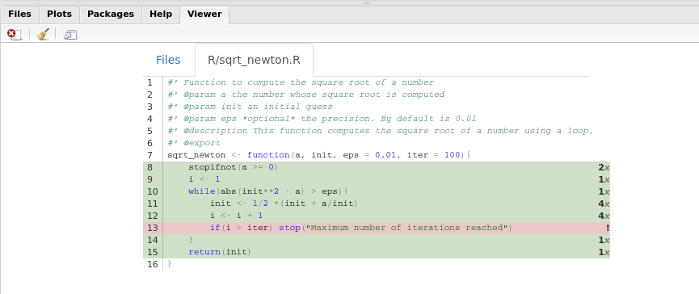
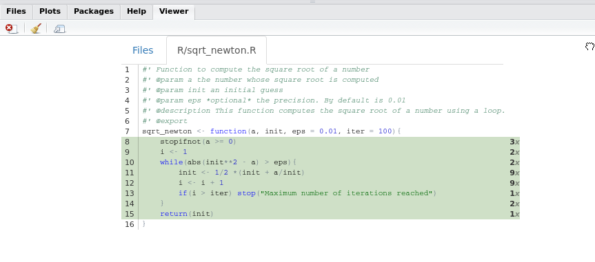

# Chapter 5 Packages

## 5.1 Why you need your own packages in your life

One of the reasons you might have tried R in the first place is the
abundance of packages. As I’m writing these lines (in August 2016), 8922
packages are available on CRAN. That’s almost over 9000. This is an
absolutely crazy amount of packages\! Chances are that if you want to do
something, there’s a package for that (I’ll stop it here with the lame
references, promise\!).

So why the heck should you write your own packages? After all, with 8922
packages you’re sure to find something that suits your needs, right? No.
Simply because the data sets that you’re working with are probably
unique to your workplace or maybe what you want to do with them is
unique to your needs. You won’t find a package that will take care of
cleaning *your* data for you.

Ok, but is it necessary to write a package? Why not just write functions
inside some scripts and then simply run these scripts? This seems like a
valid solution at first. However, it quickly becomes tedious, especially
if you have multiple scripts scattered around your computer or inside
different subfolders. You’ll also have to write the documentation on
separate files and these can easily get lost or become outdated.

Having everything inside a package takes care of these headaches for
you. And code that is inside packages is very easy to test, especially
if you’re using Rstudio. It also makes it possible to use the wonderful
`covr` package, which tells you which lines in which functions are
called by your tests. If some lines are missing, write tests that invoke
them and increase the coverage of your tests\!

As I mentioned in the introduction, if you want to learn much more than
I’ll show about packages read Wickham
([2014](#ref-wickham2014)[a](#ref-wickham2014)). I will only show you
the basics, but it should be enough to get you productive.

One last thing: if you don’t know git, you really should learn git. I
won’t talk about it here, because there’s a ton of books on git, such as
Silverman ([2013](#ref-silverman2013git)). I learned by reading it and
googling whenever I had a problem. Learning git is really worth it,
especially if you’re collaborating with some colleagues on your
packages.

## 5.2 R packages: the basics

To start writing a package, the easiest way is to load up Rstudio and
start a new project, under the *File* menu. If you’re starting from
scratch, just choose the first option, *New Directory* and then *R
package*. Give a new to your package, for example `myFirstPackage` and
you can also choose to use git for version control. Now if you check the
folder where you chose to save your package, you will see a folder with
the same name as your package, and inside this folder a lot of new files
and other folders. The most important folder for now is the `R` folder.
This is the folder that will hold your `.R` source code files. You can
also see these files and folders inside the *Files* panel from within
Rstudio. Rstudio will also have `hello.R` opened, which is a single demo
source file inside the `R` folder. You can get rid of this file.


The picture above shows the basic structure of your package. As a first
step, create a script called `square_root_loop.R` and put the following
code in it:

``` sourceCode r
sqrt_newton <- function(a, init, eps = 0.01, iter = 100){
    stopifnot(a >= 0)
    i <- 1
    while(abs(init**2 - a) > eps){
        init <- 1/2 *(init + a/init)
        i <- i + 1
        if(i > iter) stop("Maximum number of iterations reached")
    }
    return(init)
}
```

Then save this script. You can now test your package by building your
package, either by clicking on the button named *Build and Reload*
button which you can find inside the *Build* pane or by using the
following keyboard shortcut: `CTRL-SHIFT-B`. You will use *Build and
Reload* quite often, so I advise you remember this shortcut\! In the
next section we will see how we can add documentation to our functions.

## 5.3 Writing documentation for your functions

Writing documentation for your functions is very streamlined, thanks to
the `roxygen2` package. Suppose we want to write documentation for our
square root function:

``` sourceCode r
sqrt_newton <- function(a, init, eps = 0.01, iter = 100){
    stopifnot(a >= 0)
    i <- 1
    while(abs(init**2 - a) > eps){
        init <- 1/2 *(init + a/init)
        i <- i + 1
        if(i > iter) stop("Maximum number of iterations reached")
    }
    return(init)
}
```

Usually, you would write comments to describe what your function does,
what are its inputs and outputs. ‘roxygen2’ is a package that turns
these comments into documentation. Here is what our function would look
like with `roxygen2` type comments:

``` sourceCode r
#' Function to compute the square root of a number
#' @param a the number whose square root is computed
#' @param init an initial guess
#' @param eps *optional* the precision. Default value: 0.01
#' @param iter *optional* the number of iteration. Default value: 100
#' @description This function computes the square root of a number using a loop.
#' @export
sqrt_newton <- function(a, init, eps = 0.01, iter = 100){
    stopifnot(a >= 0)
    i <- 1
    while(abs(init**2 - a) > eps){
        init <- 1/2 *(init + a/init)
        i <- i + 1
        if(i > iter) stop("Maximum number of iterations reached")
    }
    return(init)
}
```

The first difference with standard comments is that `roxygen2` type
comments start with the `#'` symbol instead of simply the `#` symbol.
Then, after `#'` you can supply different keywords such as `@param`,
`@description`, `@export`. These keywords are then used by the
`roxygenise()` function from the `roxygen` package to create the
documentation files inside your package. Before `roxygen`, these
documentation files were written in the `.Rd` format by hand. Now these
files get created automagically by simply formatting your comments with
this specific syntax and then running

``` sourceCode r
roxygen2::roxygenise()
```

in the command prompt. Try it, you should see the following in the
command prompt:

    Writing sqrt_newton.Rd

then you can *Build and Reload* your package again using `CTRL-SHIFT-B`.
If you go check the documentation of your function inside your package,
this is what you should see:


There is still a keyword that I did not mention: the `@export` keyword.
This keyword is needed if you want your function to be accessible by the
user without prepending the package name, like this:

``` sourceCode r
my_package::my_function
```

Not using `@export` can be useful though, if you want to have helper
functions that are used by your other functions inside your package, and
if you wish to not make these functions accessible to the users.

## 5.4 Unit test your package

Now that we know the basics of creating a package, we move on to unit
testing your package. Unit testing is very useful, but require some
work, especially because you have to run them often to make them truly
worth your time. However running them often can be painful because you
have to be careful with the current working directory. The simplest way
to do unit testing is to put your functions inside a package and write
unit tests for these functions and use Rstudio’s keyboard shortcuts to
run your tests. First of all, create a folder called `tests` in the root
of your package and inside this `tests` folder create another folder,
called `testthat`. The `testthat` folder will hold your unit tests.
Inside the `tests` folder, create a script called `test_sqrt_newton.R`
and put the following code in it:

``` sourceCode r
library("testthat")
library("myFirstPackage")

test_that("Test sqrt_newton: positive numeric",{
    eps <- 0.001
    expected <- 2
    actual <- sqrt_newton(4, 1, eps = eps)
    expect_lt(abs(expected - actual), eps)
})
```

Save this file and use the following keyboard shortcut: `CTRL-SHIFT-T`
to run your unit test. You will see the following output:

    ==> devtools::test()
    
    Loading myFirstPackage
    Loading required package: testthat
    Testing myFirstPackage
    .
    DONE ===========================================================================

You can of course add more unit tests inside the same file. Add the
following code to `test_sqrt_newton.R`:

``` sourceCode r
test_that("Test sqrt_newton: negative numeric",{
    expect_error(sqrt_newton(-4, 1))
})
```

You will now see the following output:

    ==> devtools::test()
    
    Loading myFirstPackage
    Loading required package: testthat
    Testing myFirstPackage
    ..
    DONE ===========================================================================

Notice the two `.` above `DONE`. This means that two unit tests passed.
If a unit test does not pass, you will of course get notified. For
example, add the following test to `test_sqrt_newton.R`:

``` sourceCode r
test_that("Test sqrt_newton: with a string!",{
    expect_equal(4, sqrt_newton("WontWork", 1))
})
```

and if you try running your tests this is what you will see:

    ==> devtools::test()
    
    Loading myFirstPackage
    Loading required package: testthat
    Testing myFirstPackage
    ..1
    Failed -------------------------------------------------------------------------
    1. Error: Test sqrt_newton: with a string! (@test_sqrt_newton.R#15) ------------
    non-numeric argument to binary operator
    1: expect_equal(4, sqrt_newton("WontWork", 1)) at /home/bro/Documents/myFirstPackage/inst/tests/test_sqrt_newton.R:15
    2: compare(object, expected, ...)
    3: compare.numeric(object, expected, ...)
    4: all.equal(x, y, tolerance = tolerance, ...)
    5: all.equal.numeric(x, y, tolerance = tolerance, ...)
    6: attr.all.equal(target, current, tolerance = tolerance, scale = scale, ...)
    7: mode(current)
    8: sqrt_newton("WontWork", 1)
    
    DONE ===========================================================================

You can then either modify the test if you made a mistake writing the
test, or amend your function if your test is correct and needs to pass,
but does not because there is an error in your function. For now, simply
remove these lines for your `test_sqrt_newton.R` script.

Another interesting feature you should use once in a while, is the
*Check Package* command using `CTRL-SHIFT-E`. This command will find
errors and other mistakes and warns you. For example, when I ran this
command I got the following report:

    checking DESCRIPTION meta-information ... WARNING
    Non-standard license specification:
      What license is it under?
    Standardizable: FALSE
    
    checking for code/documentation mismatches ... WARNING
    Codoc mismatches from documentation object 'sqrt_newton':
    sqrt_newton
      Code: function(a, init, eps = 0.01, iter = 100)
      Docs: function(a, init, eps = 0.01)
      Argument names in code not in docs:
        iter

*Check Package* is telling me that I did not specify a license for my
package, and that I did not document the `iter` parameter. This command
takes some time to run, so do not run it as often as your unit tests,
but do not forget about it either\!

## 5.5 Checking the coverage of your unit tests with `covr`

To check the coverage of your package run the following code:

``` sourceCode r
library("covr")

cov <- package_coverage()

shine(cov)
```

The line `shine(cov)` launches an interactive shiny app inside your
viewer pane with the following:



We see that no unit test executes the highlighted line. So let’s write a
unit test to test this line and increase the coverage of our package\!
Add the following test to `test_sqrt_newton.R`:

``` sourceCode r
test_that("Test maximum number of iterations",{
    expect_error(sqrt_newton(10, 1E10, eps=1E-10, 5))
})
```

Now if you look at the coverage of the package:



In this example, we used `package_coverage()`, but if you are interested
in the coverage of a single function you can use `function_coverage()`,
or even `file_coverage()` to get the coverage of a single file. However,
I suggest to always run `package_coverage()` since we are working inside
a package. There are other functions in the `covr` package that might be
useful depending on your needs, so do not hesitate to explore `covr`
documentation\!

## 5.6 Wrap-up

  - Packages are the easiest way to organize, document and test your
    code.
  - You do not need to take care of paths anymore.
  - You do not need to write documentation “by hand”.
  - If you use Rstudio, the workflow is very streamlined and you can use
    version control to keep track of your changes.
  - Developing a package is also the easiest way to share your code with
    colleagues at your company or online.

### References

Wickham, Hadley. 2014a. *Advanced R*. CRC Press.

Silverman, Richard E. 2013. *Git Pocket Guide*. “ O’Reilly Media, Inc.”