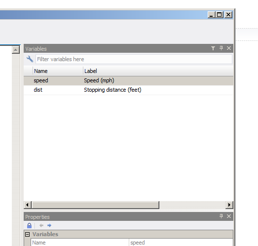

# Chapter 4 The `tidyverse`

The `tidyverse` is the name given to a certain number of packages, most
of all (if not all?) developed by, or co-developed by, Hadley Wickham.
There's a website that introduces them all: [The
tidyverse](http://tidyverse.org/). In this chapter, we are going to
learn about some functions of some of these packages. We already know a
little bit about `purrr`; let's discover what these other packages have
to offer\!

However, before reading everything that follows, I'd suggest you watch
Hadley Wickham's talk [Expressing yourself with
R](https://www.youtube.com/watch?v=1POb5fx_m3I). R is a computer
*language*, and as with any language we really are writing things that
are supposed to be read and understood by others, not just the computer.
Even if you're working alone, you owe it to your future self to write
clean, easy to understand code. Using the tidyverse and adopting the
principles presented in the talk will put you in the right mindset for
everything that follows\!

First of all, let's install the `tidyverse` packages. You can install
them one by one, or you can install the `tidyverse` meta-package:

``` sourceCode r
install.packages("tidyverse")
```

I suggest you do just that, as we're going to skim over all the
packages. To start an analysis, we first have to import data into R.

## 4.1 Smoking is bad for you, but pipes are your friend

The title of this section might sound weird at first, but by the end of
it, you'll get this (terrible) pun.

You probably know the following painting by René Magritte, *La trahison
des images*:


It turns out there's an R package from the `tidyverse` that is called
`magrittr`. What does this package do? It brings *pipes* to R. Pipes are
a concept from the Unix operating system; if you're using a GNU+Linux
distribution or macOS, you're basically using a *modern* unix. (That's
an oversimplification, but I'm an economist by training, and
outrageously oversimplifying things is what we do, deal with it.)

The idea of pipes is to take the output of a command, and *feed* it as
the input of another command. The `magrittr` package brings pipes to R,
by using the weird looking `%>%`. Try the following:

``` sourceCode r
library(magrittr)
```

``` sourceCode r
16 %>% sqrt
```

    ## [1] 4

Super weird right? But you probably understand what happened; `16` got
fed as the first argument of the function `sqrt()`. You can chain
multiple functions:

``` sourceCode r
16 %>% sqrt %>% `+`(18)
```

    ## [1] 22

The output of `16` (`16`) got fed to `sqrt()`, and the output of
`sqrt(16)` (4) got fed to `+(18)` (22). Without `%>%` you'd write the
line just above like this:

``` sourceCode r
sqrt(16) + 18
```

    ## [1] 22

It might not be very clear right now why this is useful, but the `%>%`
is probably one of the best things that R has, because when using
packages from the `tidyverse`, you will naturally want to chain a lot of
functions together. Without the `%>%` it would become messy very fast.

`%>%` is not the only pipe operator in `magrittr`. There's `%T%`, `%<>%`
and `%$%`. All have their uses, but are basically shortcuts to some
common tasks with `%>%` plus another function. Which means that you can
live without them, and because of this, I will only discuss them briefly
once we'll have learned about the other `tidyverse`
packages.

## 4.2 Getting data into R with `readr`, `readxl`, `haven` and what are *tibbles*

You probably already know how to import data in R, but maybe you are not
familiar with these packages. Using them is pretty straightforward, and
I will only discuss `haven` a little bit more than `readr` or `readxl`.
`readr` allows you to import `*.csv` files as well as other files in
plain text. The functions included in `readr` are fairly
straightforward, but there is an aspect that I really like about them:
if they fail to read your data you can get a report of what went wrong
with the `problems()` function. I suggest you read the [Data import
chapter](http://r4ds.had.co.nz/data-import.html) of R for Data Science,
to get to know `readr` better. But for our purposes, knowing the basic
`read_csv()` function is enough.

`readxl` is very similar to `readr` but focuses on importing Excel
sheets into R. Read more about it on the [tidyverse
website](http://readxl.tidyverse.org/).

`haven` imports data from STATA, SAS and SPSS. I'm going into a bit more
detail here, by showing an example with a STATA file. STATA files are
usually labelled, and I'd like to show how to work with these labels
using R. We're going to work with the `mtcars` dataset. I used STATA 14
to label the variables; so the dataset looks like one you could have to
work with one day.

``` sourceCode r
mtcars_stata <- haven::read_dta("images/mtcars.dta")
head(mtcars_stata)
```

    ## # A tibble: 6 x 12
    ##                 car   mpg   cyl  disp    hp  drat    wt  qsec    vs    am
    ##               <chr> <dbl> <dbl> <dbl> <dbl> <dbl> <dbl> <dbl> <dbl> <dbl>
    ## 1         Mazda RX4  21.0     6   160   110  3.90 2.620 16.46     0     1
    ## 2     Mazda RX4 Wag  21.0     6   160   110  3.90 2.875 17.02     0     1
    ## 3        Datsun 710  22.8     4   108    93  3.85 2.320 18.61     1     1
    ## 4    Hornet 4 Drive  21.4     6   258   110  3.08 3.215 19.44     1     0
    ## 5 Hornet Sportabout  18.7     8   360   175  3.15 3.440 17.02     0     0
    ## 6           Valiant  18.1     6   225   105  2.76 3.460 20.22     1     0
    ## # ... with 2 more variables: gear <dbl>, carb <dbl>

You don't see it here, but the columns are labelled. Try the
    following:

``` sourceCode r
str(mtcars_stata$car)
```

    ##  atomic [1:32] Mazda RX4 Mazda RX4 Wag Datsun 710 Hornet 4 Drive ...
    ##  - attr(*, "label")= chr "Make and model of the car"
    ##  - attr(*, "format.stata")= chr "%19s"

As you can see, the `car` column has the `label` attribute, which equals
“Make and model of the car”. The other columns are also labelled:

``` sourceCode r
str(mtcars_stata$cyl)
```

    ##  atomic [1:32] 6 6 4 6 8 6 8 4 4 6 ...
    ##  - attr(*, "label")= chr "Number of cylinders"
    ##  - attr(*, "format.stata")= chr "%8.0g"

``` sourceCode r
str(mtcars_stata$am)
```

    ##  atomic [1:32] 1 1 1 0 0 0 0 0 0 0 ...
    ##  - attr(*, "label")= chr "Transmission (0 = automatic, 1 = manual)"
    ##  - attr(*, "format.stata")= chr "%8.0g"

Another way to get the label is to use the `attr()` function:

``` sourceCode r
attr(mtcars_stata$cyl, "label")
```

    ## [1] "Number of cylinders"

Let's use what we learned until now to get the labels of all the
columns:

``` sourceCode r
show_labels <- function(dataset){
  map(dataset, function(col)(attr(col, "label")))
}

show_labels(mtcars_stata)
```

    ## $car
    ## [1] "Make and model of the car"
    ## 
    ## $mpg
    ## [1] "Miles/(US) gallon"
    ## 
    ## $cyl
    ## [1] "Number of cylinders"
    ## 
    ## $disp
    ## [1] "Displacement (cu.in.)"
    ## 
    ## $hp
    ## [1] "Gross horsepower"
    ## 
    ## $drat
    ## [1] "Rear axle ratio"
    ## 
    ## $wt
    ## [1] "Weight (1000 lbs)"
    ## 
    ## $qsec
    ## [1] "1/4 mile time"
    ## 
    ## $vs
    ## [1] "V/S"
    ## 
    ## $am
    ## [1] "Transmission (0 = automatic, 1 = manual)"
    ## 
    ## $gear
    ## [1] "Number of forward gears"
    ## 
    ## $carb
    ## [1] "Number of carburetors"

Could we label any dataset and then export it to a `.dta` file and have
the labels in STATA? Let's find out with the `cars` dataset:

``` sourceCode r
data(cars)

attr(cars$speed, "label") <- "Speed (mph)"
attr(cars$dist, "label") <- "Stopping distance (feet)"

haven::write_dta(cars, "images/cars.dta")
```

Below you see that `cars.dta` file opened in STATA:



When you use any of the discussed packages to import data, the resulting
object is a `tibble`. `tibble`s are modern day ‘data.frame's. The first
thing you might have noticed is when you print a `tibble` vs a
'data.frame':

``` sourceCode r
data(mtcars)

print(mtcars)
```

    ##                      mpg cyl  disp  hp drat    wt  qsec vs am gear carb
    ## Mazda RX4           21.0   6 160.0 110 3.90 2.620 16.46  0  1    4    4
    ## Mazda RX4 Wag       21.0   6 160.0 110 3.90 2.875 17.02  0  1    4    4
    ## Datsun 710          22.8   4 108.0  93 3.85 2.320 18.61  1  1    4    1
    ## Hornet 4 Drive      21.4   6 258.0 110 3.08 3.215 19.44  1  0    3    1
    ## Hornet Sportabout   18.7   8 360.0 175 3.15 3.440 17.02  0  0    3    2
    ## Valiant             18.1   6 225.0 105 2.76 3.460 20.22  1  0    3    1
    ## Duster 360          14.3   8 360.0 245 3.21 3.570 15.84  0  0    3    4
    ## Merc 240D           24.4   4 146.7  62 3.69 3.190 20.00  1  0    4    2
    ## Merc 230            22.8   4 140.8  95 3.92 3.150 22.90  1  0    4    2
    ## Merc 280            19.2   6 167.6 123 3.92 3.440 18.30  1  0    4    4
    ## Merc 280C           17.8   6 167.6 123 3.92 3.440 18.90  1  0    4    4
    ## Merc 450SE          16.4   8 275.8 180 3.07 4.070 17.40  0  0    3    3
    ## Merc 450SL          17.3   8 275.8 180 3.07 3.730 17.60  0  0    3    3
    ## Merc 450SLC         15.2   8 275.8 180 3.07 3.780 18.00  0  0    3    3
    ## Cadillac Fleetwood  10.4   8 472.0 205 2.93 5.250 17.98  0  0    3    4
    ## Lincoln Continental 10.4   8 460.0 215 3.00 5.424 17.82  0  0    3    4
    ## Chrysler Imperial   14.7   8 440.0 230 3.23 5.345 17.42  0  0    3    4
    ## Fiat 128            32.4   4  78.7  66 4.08 2.200 19.47  1  1    4    1
    ## Honda Civic         30.4   4  75.7  52 4.93 1.615 18.52  1  1    4    2
    ## Toyota Corolla      33.9   4  71.1  65 4.22 1.835 19.90  1  1    4    1
    ## Toyota Corona       21.5   4 120.1  97 3.70 2.465 20.01  1  0    3    1
    ## Dodge Challenger    15.5   8 318.0 150 2.76 3.520 16.87  0  0    3    2
    ## AMC Javelin         15.2   8 304.0 150 3.15 3.435 17.30  0  0    3    2
    ## Camaro Z28          13.3   8 350.0 245 3.73 3.840 15.41  0  0    3    4
    ## Pontiac Firebird    19.2   8 400.0 175 3.08 3.845 17.05  0  0    3    2
    ## Fiat X1-9           27.3   4  79.0  66 4.08 1.935 18.90  1  1    4    1
    ## Porsche 914-2       26.0   4 120.3  91 4.43 2.140 16.70  0  1    5    2
    ## Lotus Europa        30.4   4  95.1 113 3.77 1.513 16.90  1  1    5    2
    ## Ford Pantera L      15.8   8 351.0 264 4.22 3.170 14.50  0  1    5    4
    ## Ferrari Dino        19.7   6 145.0 175 3.62 2.770 15.50  0  1    5    6
    ## Maserati Bora       15.0   8 301.0 335 3.54 3.570 14.60  0  1    5    8
    ## Volvo 142E          21.4   4 121.0 109 4.11 2.780 18.60  1  1    4    2

``` sourceCode r
print(mtcars_stata)
```

    ## # A tibble: 32 x 12
    ##                  car   mpg   cyl  disp    hp  drat    wt  qsec    vs    am
    ##                <chr> <dbl> <dbl> <dbl> <dbl> <dbl> <dbl> <dbl> <dbl> <dbl>
    ##  1         Mazda RX4  21.0     6 160.0   110  3.90 2.620 16.46     0     1
    ##  2     Mazda RX4 Wag  21.0     6 160.0   110  3.90 2.875 17.02     0     1
    ##  3        Datsun 710  22.8     4 108.0    93  3.85 2.320 18.61     1     1
    ##  4    Hornet 4 Drive  21.4     6 258.0   110  3.08 3.215 19.44     1     0
    ##  5 Hornet Sportabout  18.7     8 360.0   175  3.15 3.440 17.02     0     0
    ##  6           Valiant  18.1     6 225.0   105  2.76 3.460 20.22     1     0
    ##  7        Duster 360  14.3     8 360.0   245  3.21 3.570 15.84     0     0
    ##  8         Merc 240D  24.4     4 146.7    62  3.69 3.190 20.00     1     0
    ##  9          Merc 230  22.8     4 140.8    95  3.92 3.150 22.90     1     0
    ## 10          Merc 280  19.2     6 167.6   123  3.92 3.440 18.30     1     0
    ## # ... with 22 more rows, and 2 more variables: gear <dbl>, carb <dbl>

Only the first 10 lines of the `tibble` get printed, but the number of
remaining lines and the names of the columns that didn't find are shown
as well as the types of the columns.

You can easily create a `tibble` from vectors:

``` sourceCode r
library(tibble)

set.seed(123)
example <- tibble(a = seq(1,5), b = rnorm(5), c = rpois(5, 3))

print(example)
```

    ## # A tibble: 5 x 3
    ##       a           b     c
    ##   <int>       <dbl> <int>
    ## 1     1 -0.56047565     6
    ## 2     2 -0.23017749     3
    ## 3     3  1.55870831     4
    ## 4     4  0.07050839     3
    ## 5     5  0.12928774     1

Even better than `print()`, there's `glimpse()`:

``` sourceCode r
glimpse(mtcars_stata)
```

    ## Observations: 32
    ## Variables: 12
    ## $ car  <chr> "Mazda RX4", "Mazda RX4 Wag", "Datsun 710", "Hornet 4 Dri...
    ## $ mpg  <dbl> 21.0, 21.0, 22.8, 21.4, 18.7, 18.1, 14.3, 24.4, 22.8, 19....
    ## $ cyl  <dbl> 6, 6, 4, 6, 8, 6, 8, 4, 4, 6, 6, 8, 8, 8, 8, 8, 8, 4, 4, ...
    ## $ disp <dbl> 160.0, 160.0, 108.0, 258.0, 360.0, 225.0, 360.0, 146.7, 1...
    ## $ hp   <dbl> 110, 110, 93, 110, 175, 105, 245, 62, 95, 123, 123, 180, ...
    ## $ drat <dbl> 3.90, 3.90, 3.85, 3.08, 3.15, 2.76, 3.21, 3.69, 3.92, 3.9...
    ## $ wt   <dbl> 2.620, 2.875, 2.320, 3.215, 3.440, 3.460, 3.570, 3.190, 3...
    ## $ qsec <dbl> 16.46, 17.02, 18.61, 19.44, 17.02, 20.22, 15.84, 20.00, 2...
    ## $ vs   <dbl> 0, 0, 1, 1, 0, 1, 0, 1, 1, 1, 1, 0, 0, 0, 0, 0, 0, 1, 1, ...
    ## $ am   <dbl> 1, 1, 1, 0, 0, 0, 0, 0, 0, 0, 0, 0, 0, 0, 0, 0, 0, 1, 1, ...
    ## $ gear <dbl> 4, 4, 4, 3, 3, 3, 3, 4, 4, 4, 4, 3, 3, 3, 3, 3, 3, 4, 4, ...
    ## $ carb <dbl> 4, 4, 1, 1, 2, 1, 4, 2, 2, 4, 4, 3, 3, 3, 4, 4, 4, 1, 2, ...

`tibble`s are lazy, which means that something like this is valid:

``` sourceCode r
set.seed(123)
example <- tibble(a = seq(1,5), b = rnorm(5), c = 10 * b)

glimpse(example)
```

    ## Observations: 5
    ## Variables: 3
    ## $ a <int> 1, 2, 3, 4, 5
    ## $ b <dbl> -0.56047565, -0.23017749, 1.55870831, 0.07050839, 0.12928774
    ## $ c <dbl> -5.6047565, -2.3017749, 15.5870831, 0.7050839, 1.2928774

The `tibble` package contains some other useful functions, such as
`tribble()`, which allows you to create a `tibble` row by row:

``` sourceCode r
set.seed(123)

example <- tribble(
  ~a, ~b, ~c,
  1, 2, "spam",
  3, 4, "eggs",
  5, 6, "bacon"
)

glimpse(example)
```

    ## Observations: 3
    ## Variables: 3
    ## $ a <dbl> 1, 3, 5
    ## $ b <dbl> 2, 4, 6
    ## $ c <chr> "spam", "eggs", "bacon"

Another thing I find very useful is the
    following:

``` sourceCode r
mtcars$m
```

    ##  [1] 21.0 21.0 22.8 21.4 18.7 18.1 14.3 24.4 22.8 19.2 17.8 16.4 17.3 15.2
    ## [15] 10.4 10.4 14.7 32.4 30.4 33.9 21.5 15.5 15.2 13.3 19.2 27.3 26.0 30.4
    ## [29] 15.8 19.7 15.0 21.4

``` sourceCode r
mtcars_stata$m
```

    ## Warning: Unknown or uninitialised column: 'm'.

    ## NULL

`mtcars$m` shows the `mpg` column… for some reason. There might be a
good reason for this, but I prefer `tibble`s' behaviour of notifying the
user that this column does not exist.

It is possible to convert a lot of objects into `tibble`s:

``` sourceCode r
example <- matrix(rnorm(36), nrow = 6)

as_tibble(example)
```

    ## # A tibble: 6 x 6
    ##            V1         V2         V3         V4         V5         V6
    ##         <dbl>      <dbl>      <dbl>      <dbl>      <dbl>      <dbl>
    ## 1 -0.56047565  0.4609162  0.4007715  0.7013559 -0.6250393  0.4264642
    ## 2 -0.23017749 -1.2650612  0.1106827 -0.4727914 -1.6866933 -0.2950715
    ## 3  1.55870831 -0.6868529 -0.5558411 -1.0678237  0.8377870  0.8951257
    ## 4  0.07050839 -0.4456620  1.7869131 -0.2179749  0.1533731  0.8781335
    ## 5  0.12928774  1.2240818  0.4978505 -1.0260044 -1.1381369  0.8215811
    ## 6  1.71506499  0.3598138 -1.9666172 -0.7288912  1.2538149  0.6886403

``` sourceCode r
example_df <- as.data.frame(example)

as_tibble(example_df)
```

    ## # A tibble: 6 x 6
    ##            V1         V2         V3         V4         V5         V6
    ##         <dbl>      <dbl>      <dbl>      <dbl>      <dbl>      <dbl>
    ## 1 -0.56047565  0.4609162  0.4007715  0.7013559 -0.6250393  0.4264642
    ## 2 -0.23017749 -1.2650612  0.1106827 -0.4727914 -1.6866933 -0.2950715
    ## 3  1.55870831 -0.6868529 -0.5558411 -1.0678237  0.8377870  0.8951257
    ## 4  0.07050839 -0.4456620  1.7869131 -0.2179749  0.1533731  0.8781335
    ## 5  0.12928774  1.2240818  0.4978505 -1.0260044 -1.1381369  0.8215811
    ## 6  1.71506499  0.3598138 -1.9666172 -0.7288912  1.2538149  0.6886403

``` sourceCode r
example_list <- list(a = seq(1,5), b = seq(6, 10))

as_tibble(example_list)
```

    ## # A tibble: 5 x 2
    ##       a     b
    ##   <int> <int>
    ## 1     1     6
    ## 2     2     7
    ## 3     3     8
    ## 4     4     9
    ## 5     5    10

You can also convert named vectors to `tibble`s with enframe:

``` sourceCode r
recipe <- c("spam" = 1, "eggs" = 3, "bacon" = 10)

enframe(recipe, "ingredients", "quantity")
```

    ## # A tibble: 3 x 2
    ##   ingredients quantity
    ##         <chr>    <dbl>
    ## 1        spam        1
    ## 2        eggs        3
    ## 3       bacon       10

Contrast this to `as_tibble()` or as `as.data.frame()`:

``` sourceCode r
as.data.frame(recipe)
```

    ##       recipe
    ## spam       1
    ## eggs       3
    ## bacon     10

``` sourceCode r
as_tibble(recipe)
```

    ## # A tibble: 3 x 1
    ##   value
    ## * <dbl>
    ## 1     1
    ## 2     3
    ## 3    10

There are a lot of other functions in the `tibble` package that you
might find useful. I suggest you take a look at all of them and see what
you can integrate in your workflow\!

## 4.3 Transforming your data with `dplyr`

You may have never heard of the `tidyverse`, but you most certainly
heard about `dplyr` and `tidyr`. Both these packages are probably the
most popular packages of the tidyverse. Even if you know these packages
already, you might not be using some more advanced functions, I'm
talking about the *scoped* version of the usual `dplyr` *verbs* (`dplyr`
*verbs* is how Hadley Wickham refers to the functions included in the
package: `group_by()`, `select()`, etc).

This is going to be long, so prepare some coffee, lock the door to your
study, turn off your phone and buckle up.

### 4.3.1 `filter()` and friends

We're going to use the `Gasoline` dataset from the `plm` package, so
install that first:

``` sourceCode r
install.packages("plm")
```

Then load the required data:

``` sourceCode r
data(Gasoline, package = "plm")
```

and load dplyr:

``` sourceCode r
library(dplyr)
```

    ## 
    ## Attaching package: 'dplyr'

    ## The following objects are masked from 'package:stats':
    ## 
    ##     filter, lag

    ## The following objects are masked from 'package:base':
    ## 
    ##     intersect, setdiff, setequal, union

This dataset gives the consumption of gasoline for 18 countries from
1960 to 1978. When you load the data like this, it is a standard
`data.frame`. `dplyr` functions can be used on standard `data.frame`
objects, but just because we learned about `tibble`'s, let's convert the
data to a `tibble` and change its name:

``` sourceCode r
gasoline <- as_tibble(Gasoline)
```

`filter()` is pretty straightforward. What if you would like to subset
the data to focus on the year 1969? Simple:

``` sourceCode r
filter(gasoline, year == 1969)
```

    ## # A tibble: 18 x 6
    ##     country  year lgaspcar  lincomep      lrpmg   lcarpcap
    ##      <fctr> <int>    <dbl>     <dbl>      <dbl>      <dbl>
    ##  1  AUSTRIA  1969 4.046355 -6.153140 -0.5591105  -8.788686
    ##  2  BELGIUM  1969 3.854601 -5.857532 -0.3548085  -8.521453
    ##  3   CANADA  1969 4.864433 -5.560853 -1.0368639  -8.095113
    ##  4  DENMARK  1969 4.173561 -5.722769 -0.4068792  -8.470459
    ##  5   FRANCE  1969 3.773460 -5.840774 -0.3151909  -8.369136
    ##  6  GERMANY  1969 3.899185 -5.829641 -0.5892314  -8.438061
    ##  7   GREECE  1969 4.894773 -6.591104 -0.1798700 -10.713848
    ##  8  IRELAND  1969 4.208613 -6.379743 -0.2716284  -8.947265
    ##  9    ITALY  1969 3.737389 -6.282857 -0.2475668  -8.666004
    ## 10    JAPAN  1969 4.518290 -6.159308 -0.4168502  -9.607600
    ## 11 NETHERLA  1969 3.987689 -5.880556 -0.4169496  -8.634102
    ## 12   NORWAY  1969 4.086823 -5.735319 -0.3382305  -8.694593
    ## 13    SPAIN  1969 3.994103 -5.601046  0.6694895  -9.720425
    ## 14   SWEDEN  1969 3.991715 -7.771081 -2.7319041  -8.197462
    ## 15 SWITZERL  1969 4.211290 -5.912172 -0.9181216  -8.473379
    ## 16   TURKEY  1969 5.720705 -7.388646 -0.2984542 -12.518545
    ## 17     U.K.  1969 3.948058 -6.031953 -0.3833246  -8.468119
    ## 18   U.S.A.  1969 4.841383 -5.414374 -1.2231427  -7.792706

Remember the pipe operator, `%>%` from the start of this chapter? Here's
how this would work with it:

``` sourceCode r
gasoline %>% filter(year == 1969)
```

    ## # A tibble: 18 x 6
    ##     country  year lgaspcar  lincomep      lrpmg   lcarpcap
    ##      <fctr> <int>    <dbl>     <dbl>      <dbl>      <dbl>
    ##  1  AUSTRIA  1969 4.046355 -6.153140 -0.5591105  -8.788686
    ##  2  BELGIUM  1969 3.854601 -5.857532 -0.3548085  -8.521453
    ##  3   CANADA  1969 4.864433 -5.560853 -1.0368639  -8.095113
    ##  4  DENMARK  1969 4.173561 -5.722769 -0.4068792  -8.470459
    ##  5   FRANCE  1969 3.773460 -5.840774 -0.3151909  -8.369136
    ##  6  GERMANY  1969 3.899185 -5.829641 -0.5892314  -8.438061
    ##  7   GREECE  1969 4.894773 -6.591104 -0.1798700 -10.713848
    ##  8  IRELAND  1969 4.208613 -6.379743 -0.2716284  -8.947265
    ##  9    ITALY  1969 3.737389 -6.282857 -0.2475668  -8.666004
    ## 10    JAPAN  1969 4.518290 -6.159308 -0.4168502  -9.607600
    ## 11 NETHERLA  1969 3.987689 -5.880556 -0.4169496  -8.634102
    ## 12   NORWAY  1969 4.086823 -5.735319 -0.3382305  -8.694593
    ## 13    SPAIN  1969 3.994103 -5.601046  0.6694895  -9.720425
    ## 14   SWEDEN  1969 3.991715 -7.771081 -2.7319041  -8.197462
    ## 15 SWITZERL  1969 4.211290 -5.912172 -0.9181216  -8.473379
    ## 16   TURKEY  1969 5.720705 -7.388646 -0.2984542 -12.518545
    ## 17     U.K.  1969 3.948058 -6.031953 -0.3833246  -8.468119
    ## 18   U.S.A.  1969 4.841383 -5.414374 -1.2231427  -7.792706

So `gasoline`, which is a `tibble` object, is passed as the first
argument of the `filter()` function. Starting now, we're only going to
use these pipes. You will see why soon enough, so bear with me.

You can also filter more than just one year, by using the `%in%`
operator:

``` sourceCode r
gasoline %>% filter(year %in% seq(1969, 1973))
```

    ## # A tibble: 90 x 6
    ##    country  year lgaspcar  lincomep      lrpmg  lcarpcap
    ##     <fctr> <int>    <dbl>     <dbl>      <dbl>     <dbl>
    ##  1 AUSTRIA  1969 4.046355 -6.153140 -0.5591105 -8.788686
    ##  2 AUSTRIA  1970 4.080888 -6.081712 -0.5965612 -8.728200
    ##  3 AUSTRIA  1971 4.106720 -6.043626 -0.6544591 -8.635898
    ##  4 AUSTRIA  1972 4.128018 -5.981052 -0.5963318 -8.538338
    ##  5 AUSTRIA  1973 4.199381 -5.895153 -0.5944468 -8.487289
    ##  6 BELGIUM  1969 3.854601 -5.857532 -0.3548085 -8.521453
    ##  7 BELGIUM  1970 3.870392 -5.797201 -0.3779404 -8.453043
    ##  8 BELGIUM  1971 3.872245 -5.761050 -0.3992299 -8.409457
    ##  9 BELGIUM  1972 3.905402 -5.710230 -0.3106458 -8.362588
    ## 10 BELGIUM  1973 3.895996 -5.644145 -0.3730919 -8.314447
    ## # ... with 80 more rows

or even non-consecutive years:

``` sourceCode r
gasoline %>% filter(year %in% c(1969, 1973, 1977))
```

    ## # A tibble: 54 x 6
    ##    country  year lgaspcar  lincomep      lrpmg  lcarpcap
    ##     <fctr> <int>    <dbl>     <dbl>      <dbl>     <dbl>
    ##  1 AUSTRIA  1969 4.046355 -6.153140 -0.5591105 -8.788686
    ##  2 AUSTRIA  1973 4.199381 -5.895153 -0.5944468 -8.487289
    ##  3 AUSTRIA  1977 3.931676 -5.833288 -0.4219156 -8.249563
    ##  4 BELGIUM  1969 3.854601 -5.857532 -0.3548085 -8.521453
    ##  5 BELGIUM  1973 3.895996 -5.644145 -0.3730919 -8.314447
    ##  6 BELGIUM  1977 3.854311 -5.556697 -0.4316413 -8.138534
    ##  7  CANADA  1969 4.864433 -5.560853 -1.0368639 -8.095113
    ##  8  CANADA  1973 4.899694 -5.414753 -1.1331614 -7.942140
    ##  9  CANADA  1977 4.810992 -5.336967 -1.0708445 -7.768793
    ## 10 DENMARK  1969 4.173561 -5.722769 -0.4068792 -8.470459
    ## # ... with 44 more rows

`%in%` tests if an object is part of a set.

`filter()` is not the only *filtering* verb there is. Suppose that we
have a condition that we want to use to filter out a lot of columns at
once. For example, for every column that is of type `numeric`, keep only
the lines where the condition *value \> -8* is satisfied. The next line
does that:

``` sourceCode r
gasoline %>% filter_if( ~all(is.numeric(.)), all_vars(. > -8))
```

    ## # A tibble: 30 x 6
    ##    country  year lgaspcar  lincomep      lrpmg  lcarpcap
    ##     <fctr> <int>    <dbl>     <dbl>      <dbl>     <dbl>
    ##  1  CANADA  1972 4.889302 -5.436603 -1.0996670 -7.989531
    ##  2  CANADA  1973 4.899694 -5.414753 -1.1331614 -7.942140
    ##  3  CANADA  1974 4.891591 -5.418456 -1.1238000 -7.900758
    ##  4  CANADA  1975 4.888471 -5.379097 -1.1856843 -7.873313
    ##  5  CANADA  1976 4.837359 -5.361285 -1.0617966 -7.808425
    ##  6  CANADA  1977 4.810992 -5.336967 -1.0708445 -7.768793
    ##  7  CANADA  1978 4.855846 -5.311272 -1.0749507 -7.788061
    ##  8 GERMANY  1978 3.883879 -5.561733 -0.6281728 -7.950079
    ##  9  SWEDEN  1975 3.973840 -7.679557 -2.7673146 -7.994217
    ## 10  SWEDEN  1976 3.983997 -7.672043 -2.8229448 -7.956066
    ## # ... with 20 more rows

It's a bit more complicated than before. `filter_if()` needs 3 arguments
to work; the data, a predicate function (a function that returns `TRUE`,
or `FALSE`) which will select the columns we want to work on, and then
the condition. The condition can be applied to *all* the columns that
were selected by the predicate function (hence the `all_vars()`) or only
to at least one (you'd use `any_vars()` then). Try to change the
condition, or the predicate function, to figure out how `filter_if()`
works. The dot is a placeholder that stands for whatever columns where
selected.

`filter_at()` works differently; it allows the user to filter columns by
position:

``` sourceCode r
gasoline %>% filter_at(vars(ends_with("p")), all_vars(. > -8))
```

    ## # A tibble: 30 x 6
    ##    country  year lgaspcar  lincomep      lrpmg  lcarpcap
    ##     <fctr> <int>    <dbl>     <dbl>      <dbl>     <dbl>
    ##  1  CANADA  1972 4.889302 -5.436603 -1.0996670 -7.989531
    ##  2  CANADA  1973 4.899694 -5.414753 -1.1331614 -7.942140
    ##  3  CANADA  1974 4.891591 -5.418456 -1.1238000 -7.900758
    ##  4  CANADA  1975 4.888471 -5.379097 -1.1856843 -7.873313
    ##  5  CANADA  1976 4.837359 -5.361285 -1.0617966 -7.808425
    ##  6  CANADA  1977 4.810992 -5.336967 -1.0708445 -7.768793
    ##  7  CANADA  1978 4.855846 -5.311272 -1.0749507 -7.788061
    ##  8 GERMANY  1978 3.883879 -5.561733 -0.6281728 -7.950079
    ##  9  SWEDEN  1975 3.973840 -7.679557 -2.7673146 -7.994217
    ## 10  SWEDEN  1976 3.983997 -7.672043 -2.8229448 -7.956066
    ## # ... with 20 more rows

`end_with()` is a helper function that we are going to use a lot (as
well as `starts_with()` and some others, you'll see..). So the above
line means “for the columns whose name end with a ‘p' only keep the
lines where, for all the selected columns, the values are strictly
superior to `-8`”. Again, this is not very easy the first time you deal
with that, so play around with it for a bit.

`filter_all()`, as the name implies, considers all variables for the
filtering step.

`filter_if()` and `filter_at()` are very useful when you have very large
datasets with a lot of variables and you want to apply a filtering
function only to a subset of them. `filter_all()` is useful if, for
example, you only want to keep the positive values for all the columns.

### 4.3.2 `select()` and its helpers

While `filter()` and its scoped versions allow you to keep or discard
rows of data, `select()` (and its scoped versions) allow you to keep or
discard entire columns. To keep columns:

``` sourceCode r
gasoline %>% select(country, year, lrpmg)
```

    ## # A tibble: 342 x 3
    ##    country  year      lrpmg
    ##  *  <fctr> <int>      <dbl>
    ##  1 AUSTRIA  1960 -0.3345476
    ##  2 AUSTRIA  1961 -0.3513276
    ##  3 AUSTRIA  1962 -0.3795177
    ##  4 AUSTRIA  1963 -0.4142514
    ##  5 AUSTRIA  1964 -0.4453354
    ##  6 AUSTRIA  1965 -0.4970607
    ##  7 AUSTRIA  1966 -0.4668377
    ##  8 AUSTRIA  1967 -0.5058834
    ##  9 AUSTRIA  1968 -0.5224125
    ## 10 AUSTRIA  1969 -0.5591105
    ## # ... with 332 more rows

To discard them:

``` sourceCode r
gasoline %>% select(-country, -year, -lrpmg)
```

    ## # A tibble: 342 x 3
    ##    lgaspcar  lincomep  lcarpcap
    ##  *    <dbl>     <dbl>     <dbl>
    ##  1 4.173244 -6.474277 -9.766840
    ##  2 4.100989 -6.426006 -9.608622
    ##  3 4.073177 -6.407308 -9.457257
    ##  4 4.059509 -6.370679 -9.343155
    ##  5 4.037689 -6.322247 -9.237739
    ##  6 4.033983 -6.294668 -9.123903
    ##  7 4.047537 -6.252545 -9.019822
    ##  8 4.052911 -6.234581 -8.934403
    ##  9 4.045507 -6.206894 -8.847967
    ## 10 4.046355 -6.153140 -8.788686
    ## # ... with 332 more rows

To rename them:

``` sourceCode r
gasoline %>% select(country, date = year, lrpmg)
```

    ## # A tibble: 342 x 3
    ##    country  date      lrpmg
    ##  *  <fctr> <int>      <dbl>
    ##  1 AUSTRIA  1960 -0.3345476
    ##  2 AUSTRIA  1961 -0.3513276
    ##  3 AUSTRIA  1962 -0.3795177
    ##  4 AUSTRIA  1963 -0.4142514
    ##  5 AUSTRIA  1964 -0.4453354
    ##  6 AUSTRIA  1965 -0.4970607
    ##  7 AUSTRIA  1966 -0.4668377
    ##  8 AUSTRIA  1967 -0.5058834
    ##  9 AUSTRIA  1968 -0.5224125
    ## 10 AUSTRIA  1969 -0.5591105
    ## # ... with 332 more rows

There's also `rename()`, but it works a bit differently:

``` sourceCode r
gasoline %>% rename(date = year)
```

    ## # A tibble: 342 x 6
    ##    country  date lgaspcar  lincomep      lrpmg  lcarpcap
    ##  *  <fctr> <int>    <dbl>     <dbl>      <dbl>     <dbl>
    ##  1 AUSTRIA  1960 4.173244 -6.474277 -0.3345476 -9.766840
    ##  2 AUSTRIA  1961 4.100989 -6.426006 -0.3513276 -9.608622
    ##  3 AUSTRIA  1962 4.073177 -6.407308 -0.3795177 -9.457257
    ##  4 AUSTRIA  1963 4.059509 -6.370679 -0.4142514 -9.343155
    ##  5 AUSTRIA  1964 4.037689 -6.322247 -0.4453354 -9.237739
    ##  6 AUSTRIA  1965 4.033983 -6.294668 -0.4970607 -9.123903
    ##  7 AUSTRIA  1966 4.047537 -6.252545 -0.4668377 -9.019822
    ##  8 AUSTRIA  1967 4.052911 -6.234581 -0.5058834 -8.934403
    ##  9 AUSTRIA  1968 4.045507 -6.206894 -0.5224125 -8.847967
    ## 10 AUSTRIA  1969 4.046355 -6.153140 -0.5591105 -8.788686
    ## # ... with 332 more rows

`rename()` does not do any kind of selection, but just renames.

To re-order them:

``` sourceCode r
gasoline %>% select(year, country, lrpmg, everything())
```

    ## # A tibble: 342 x 6
    ##     year country      lrpmg lgaspcar  lincomep  lcarpcap
    ##  * <int>  <fctr>      <dbl>    <dbl>     <dbl>     <dbl>
    ##  1  1960 AUSTRIA -0.3345476 4.173244 -6.474277 -9.766840
    ##  2  1961 AUSTRIA -0.3513276 4.100989 -6.426006 -9.608622
    ##  3  1962 AUSTRIA -0.3795177 4.073177 -6.407308 -9.457257
    ##  4  1963 AUSTRIA -0.4142514 4.059509 -6.370679 -9.343155
    ##  5  1964 AUSTRIA -0.4453354 4.037689 -6.322247 -9.237739
    ##  6  1965 AUSTRIA -0.4970607 4.033983 -6.294668 -9.123903
    ##  7  1966 AUSTRIA -0.4668377 4.047537 -6.252545 -9.019822
    ##  8  1967 AUSTRIA -0.5058834 4.052911 -6.234581 -8.934403
    ##  9  1968 AUSTRIA -0.5224125 4.045507 -6.206894 -8.847967
    ## 10  1969 AUSTRIA -0.5591105 4.046355 -6.153140 -8.788686
    ## # ... with 332 more rows

`everything()` is another of those helper functions (like
`starts_with()`, and `ends_with()`). What if we are only interested in
columns whose name start with “l”?

``` sourceCode r
gasoline %>% select(starts_with("l"))
```

    ## # A tibble: 342 x 4
    ##    lgaspcar  lincomep      lrpmg  lcarpcap
    ##  *    <dbl>     <dbl>      <dbl>     <dbl>
    ##  1 4.173244 -6.474277 -0.3345476 -9.766840
    ##  2 4.100989 -6.426006 -0.3513276 -9.608622
    ##  3 4.073177 -6.407308 -0.3795177 -9.457257
    ##  4 4.059509 -6.370679 -0.4142514 -9.343155
    ##  5 4.037689 -6.322247 -0.4453354 -9.237739
    ##  6 4.033983 -6.294668 -0.4970607 -9.123903
    ##  7 4.047537 -6.252545 -0.4668377 -9.019822
    ##  8 4.052911 -6.234581 -0.5058834 -8.934403
    ##  9 4.045507 -6.206894 -0.5224125 -8.847967
    ## 10 4.046355 -6.153140 -0.5591105 -8.788686
    ## # ... with 332 more rows

The same can be achieved with `select_at()`:

``` sourceCode r
gasoline %>% select_at(vars(starts_with("l")))
```

    ## # A tibble: 342 x 4
    ##    lgaspcar  lincomep      lrpmg  lcarpcap
    ##  *    <dbl>     <dbl>      <dbl>     <dbl>
    ##  1 4.173244 -6.474277 -0.3345476 -9.766840
    ##  2 4.100989 -6.426006 -0.3513276 -9.608622
    ##  3 4.073177 -6.407308 -0.3795177 -9.457257
    ##  4 4.059509 -6.370679 -0.4142514 -9.343155
    ##  5 4.037689 -6.322247 -0.4453354 -9.237739
    ##  6 4.033983 -6.294668 -0.4970607 -9.123903
    ##  7 4.047537 -6.252545 -0.4668377 -9.019822
    ##  8 4.052911 -6.234581 -0.5058834 -8.934403
    ##  9 4.045507 -6.206894 -0.5224125 -8.847967
    ## 10 4.046355 -6.153140 -0.5591105 -8.788686
    ## # ... with 332 more rows

`select_at()` can be quite useful if you know the position of the
columns you're interested in:

``` sourceCode r
gasoline %>% select_at(vars(c(1,2,5)))
```

    ## # A tibble: 342 x 3
    ##    country  year      lrpmg
    ##  *  <fctr> <int>      <dbl>
    ##  1 AUSTRIA  1960 -0.3345476
    ##  2 AUSTRIA  1961 -0.3513276
    ##  3 AUSTRIA  1962 -0.3795177
    ##  4 AUSTRIA  1963 -0.4142514
    ##  5 AUSTRIA  1964 -0.4453354
    ##  6 AUSTRIA  1965 -0.4970607
    ##  7 AUSTRIA  1966 -0.4668377
    ##  8 AUSTRIA  1967 -0.5058834
    ##  9 AUSTRIA  1968 -0.5224125
    ## 10 AUSTRIA  1969 -0.5591105
    ## # ... with 332 more rows

This also works with `filter_at()` by the way.

`select_if()` makes it easy to select columns that satisfy a criterium:

``` sourceCode r
gasoline %>% select_if(is.numeric)
```

    ## # A tibble: 342 x 5
    ##     year lgaspcar  lincomep      lrpmg  lcarpcap
    ##  * <int>    <dbl>     <dbl>      <dbl>     <dbl>
    ##  1  1960 4.173244 -6.474277 -0.3345476 -9.766840
    ##  2  1961 4.100989 -6.426006 -0.3513276 -9.608622
    ##  3  1962 4.073177 -6.407308 -0.3795177 -9.457257
    ##  4  1963 4.059509 -6.370679 -0.4142514 -9.343155
    ##  5  1964 4.037689 -6.322247 -0.4453354 -9.237739
    ##  6  1965 4.033983 -6.294668 -0.4970607 -9.123903
    ##  7  1966 4.047537 -6.252545 -0.4668377 -9.019822
    ##  8  1967 4.052911 -6.234581 -0.5058834 -8.934403
    ##  9  1968 4.045507 -6.206894 -0.5224125 -8.847967
    ## 10  1969 4.046355 -6.153140 -0.5591105 -8.788686
    ## # ... with 332 more rows

You can even pass a further function to `select_if()` that will be
applied to the selected columns:

``` sourceCode r
gasoline %>% select_if(is.numeric, toupper)
```

    ## # A tibble: 342 x 5
    ##     YEAR LGASPCAR  LINCOMEP      LRPMG  LCARPCAP
    ##  * <int>    <dbl>     <dbl>      <dbl>     <dbl>
    ##  1  1960 4.173244 -6.474277 -0.3345476 -9.766840
    ##  2  1961 4.100989 -6.426006 -0.3513276 -9.608622
    ##  3  1962 4.073177 -6.407308 -0.3795177 -9.457257
    ##  4  1963 4.059509 -6.370679 -0.4142514 -9.343155
    ##  5  1964 4.037689 -6.322247 -0.4453354 -9.237739
    ##  6  1965 4.033983 -6.294668 -0.4970607 -9.123903
    ##  7  1966 4.047537 -6.252545 -0.4668377 -9.019822
    ##  8  1967 4.052911 -6.234581 -0.5058834 -8.934403
    ##  9  1968 4.045507 -6.206894 -0.5224125 -8.847967
    ## 10  1969 4.046355 -6.153140 -0.5591105 -8.788686
    ## # ... with 332 more rows

Another verb, similar to `select()`, is `pull()`. Let's compare the two:

``` sourceCode r
gasoline %>% select(lrpmg)
```

    ## # A tibble: 342 x 1
    ##         lrpmg
    ##  *      <dbl>
    ##  1 -0.3345476
    ##  2 -0.3513276
    ##  3 -0.3795177
    ##  4 -0.4142514
    ##  5 -0.4453354
    ##  6 -0.4970607
    ##  7 -0.4668377
    ##  8 -0.5058834
    ##  9 -0.5224125
    ## 10 -0.5591105
    ## # ... with 332 more rows

``` sourceCode r
gasoline %>% pull(lrpmg)
```

    ##   [1] -0.33454761 -0.35132761 -0.37951769 -0.41425139 -0.44533536
    ##   [6] -0.49706066 -0.46683773 -0.50588340 -0.52241255 -0.55911051
    ##  [11] -0.59656122 -0.65445914 -0.59633184 -0.59444681 -0.46602693
    ##  [16] -0.45414221 -0.50008372 -0.42191563 -0.46960312 -0.16570961
    ##  [21] -0.17173098 -0.22229138 -0.25046225 -0.27591057 -0.34493695
    ##  [26] -0.23639770 -0.26699499 -0.31116076 -0.35480852 -0.37794044
    ##  [31] -0.39922992 -0.31064584 -0.37309192 -0.36223563 -0.36430848
    ##  [36] -0.37896584 -0.43164133 -0.59094964 -0.97210650 -0.97229024
    ##  [41] -0.97860756 -1.01904791 -1.00285696 -1.01712549 -1.01694436
    ##  [46] -1.02359713 -1.01984524 -1.03686389 -1.06733308 -1.05803676
    ##  [51] -1.09966703 -1.13316142 -1.12379997 -1.18568427 -1.06179659
    ##  [56] -1.07084448 -1.07495073 -0.19570260 -0.25361844 -0.21875400
    ##  [61] -0.24800936 -0.30654923 -0.32701542 -0.39618846 -0.44257369
    ##  [66] -0.35204752 -0.40687922 -0.44046082 -0.45473954 -0.49918863
    ##  [71] -0.43257185 -0.42517720 -0.39395431 -0.35361534 -0.35690917
    ##  [76] -0.29068135 -0.01959833 -0.02386000 -0.06892022 -0.13792900
    ##  [81] -0.19784646 -0.23365325 -0.26427164 -0.29405795 -0.32316179
    ##  [86] -0.31519087 -0.33384616 -0.37945667 -0.40781642 -0.47503429
    ##  [91] -0.21698191 -0.25838174 -0.24651309 -0.22550681 -0.38075942
    ##  [96] -0.18591078 -0.23095384 -0.34384171 -0.37464672 -0.39965256
    ## [101] -0.43987825 -0.54000197 -0.54998139 -0.43824222 -0.58923137
    ## [106] -0.63329520 -0.67176311 -0.71797458 -0.72587521 -0.56982876
    ## [111] -0.56482380 -0.62481298 -0.59761210 -0.62817279 -0.08354740
    ## [116] -0.10421997 -0.13320751 -0.15653576 -0.18051772 -0.07793999
    ## [121] -0.11491900 -0.13775849 -0.15375883 -0.17986997 -0.20252426
    ## [126] -0.06761078 -0.11973059 -0.05191029  0.31625351  0.20631574
    ## [131]  0.19319312  0.23502961  0.16896037 -0.07648118 -0.12040874
    ## [136] -0.14160039 -0.15232915 -0.24428212 -0.16899366 -0.21071901
    ## [141] -0.17383533 -0.21339314 -0.27162842 -0.32069023 -0.36041067
    ## [146] -0.42393131 -0.64567297 -0.55343875 -0.64126416 -0.66134256
    ## [151] -0.56011483 -0.66277808  0.16507708 -0.08559038 -0.18351291
    ## [156] -0.26541405 -0.42609643 -0.32712637 -0.24887418 -0.19160048
    ## [161] -0.20616656 -0.24756681 -0.23271512 -0.14822267 -0.21508857
    ## [166] -0.32508487 -0.22290860 -0.03270913  0.10292798  0.16418805
    ## [171]  0.03482212 -0.14532271 -0.14874940 -0.18731459 -0.19996473
    ## [176] -0.20386433 -0.23786571 -0.27411537 -0.33167240 -0.35126918
    ## [181] -0.41685019 -0.46203546 -0.43941354 -0.52100094 -0.46270739
    ## [186] -0.19090636 -0.15948473 -0.20726559 -0.21904447 -0.28707638
    ## [191] -0.20148480 -0.21599265 -0.25968008 -0.29718661 -0.36929389
    ## [196] -0.34197503 -0.34809007 -0.31232019 -0.44450431 -0.41694955
    ## [201] -0.39954544 -0.43393029 -0.31903240 -0.42728193 -0.35253685
    ## [206] -0.43426178 -0.42908393 -0.46474195 -0.55791459 -0.13968957
    ## [211] -0.15790514 -0.19908809 -0.23263318 -0.26374731 -0.31593124
    ## [216] -0.25011726 -0.26555763 -0.30036775 -0.33823045 -0.39072560
    ## [221] -0.30127223 -0.26023925 -0.33880765 -0.15100924 -0.32726757
    ## [226] -0.35308752 -0.38255762 -0.30765935  1.12531070  1.10956235
    ## [231]  1.05700394  0.97683534  0.91532254  0.81666055  0.75671751
    ## [236]  0.74130811  0.70386453  0.66948950  0.61217208  0.60699563
    ## [241]  0.53716844  0.43377166  0.52492096  0.62955545  0.68385409
    ## [246]  0.52627167  0.62141374 -2.52041588 -2.57148340 -2.53448158
    ## [251] -2.60511224 -2.65801626 -2.64476790 -2.63901460 -2.65609762
    ## [256] -2.67918662 -2.73190414 -2.73359211 -2.77884554 -2.77467537
    ## [261] -2.84142900 -2.79840677 -2.76731461 -2.82294480 -2.82005896
    ## [266] -2.89649671 -0.82321833 -0.86558473 -0.82218510 -0.86012004
    ## [271] -0.86767682 -0.90528668 -0.85956665 -0.90656671 -0.87232520
    ## [276] -0.91812162 -0.96344188 -1.03746081 -0.94015345 -0.86722756
    ## [281] -0.88692306 -0.88475790 -0.90736205 -0.91147285 -1.03208811
    ## [286] -0.25340821 -0.34252375 -0.40820484 -0.22499174 -0.25219448
    ## [291] -0.29347614 -0.35640491 -0.33515022 -0.36507386 -0.29845417
    ## [296] -0.39882648 -0.30461880 -0.54637424 -0.69162023 -0.33965308
    ## [301] -0.53794675 -0.75141027 -0.95552413 -0.35290961 -0.39108581
    ## [306] -0.45185308 -0.42287690 -0.46335147 -0.49577430 -0.42654915
    ## [311] -0.47068145 -0.44118786 -0.46245080 -0.38332457 -0.41899030
    ## [316] -0.46135978 -0.52777246 -0.56529718 -0.56641296 -0.20867428
    ## [321] -0.27354010 -0.50886285 -0.78652911 -1.12111489 -1.14624034
    ## [326] -1.16187449 -1.17991524 -1.20026222 -1.19428750 -1.19026054
    ## [331] -1.18991215 -1.20730059 -1.22314272 -1.25176347 -1.28131560
    ## [336] -1.33116930 -1.29066967 -1.23146686 -1.20037697 -1.15468197
    ## [341] -1.17590974 -1.21206183

`pull()`, unlike `select()`, does not return a `tibble`, but only the
atomic vector.

### 4.3.3 `group_by()`

`group_by()` is a very useful verb; as the name implies, it allows you
to create groups and then, for example, compute descriptive statistics
by groups. For example, let's group our data by country:

``` sourceCode r
gasoline %>% group_by(country)
```

    ## # A tibble: 342 x 6
    ## # Groups:   country [18]
    ##    country  year lgaspcar  lincomep      lrpmg  lcarpcap
    ##  *  <fctr> <int>    <dbl>     <dbl>      <dbl>     <dbl>
    ##  1 AUSTRIA  1960 4.173244 -6.474277 -0.3345476 -9.766840
    ##  2 AUSTRIA  1961 4.100989 -6.426006 -0.3513276 -9.608622
    ##  3 AUSTRIA  1962 4.073177 -6.407308 -0.3795177 -9.457257
    ##  4 AUSTRIA  1963 4.059509 -6.370679 -0.4142514 -9.343155
    ##  5 AUSTRIA  1964 4.037689 -6.322247 -0.4453354 -9.237739
    ##  6 AUSTRIA  1965 4.033983 -6.294668 -0.4970607 -9.123903
    ##  7 AUSTRIA  1966 4.047537 -6.252545 -0.4668377 -9.019822
    ##  8 AUSTRIA  1967 4.052911 -6.234581 -0.5058834 -8.934403
    ##  9 AUSTRIA  1968 4.045507 -6.206894 -0.5224125 -8.847967
    ## 10 AUSTRIA  1969 4.046355 -6.153140 -0.5591105 -8.788686
    ## # ... with 332 more rows

It looks like nothing much happened, but if you look at the second line
of the output you can read the following:

``` sourceCode r
## # Groups:   country [18]
```

this means that the data is grouped, and every computation you will do
now will take these groups into account. This will be clearer in the
next subsection.

It is also possible to group according to various variables:

``` sourceCode r
gasoline %>% group_by(country, year)
```

    ## # A tibble: 342 x 6
    ## # Groups:   country, year [342]
    ##    country  year lgaspcar  lincomep      lrpmg  lcarpcap
    ##  *  <fctr> <int>    <dbl>     <dbl>      <dbl>     <dbl>
    ##  1 AUSTRIA  1960 4.173244 -6.474277 -0.3345476 -9.766840
    ##  2 AUSTRIA  1961 4.100989 -6.426006 -0.3513276 -9.608622
    ##  3 AUSTRIA  1962 4.073177 -6.407308 -0.3795177 -9.457257
    ##  4 AUSTRIA  1963 4.059509 -6.370679 -0.4142514 -9.343155
    ##  5 AUSTRIA  1964 4.037689 -6.322247 -0.4453354 -9.237739
    ##  6 AUSTRIA  1965 4.033983 -6.294668 -0.4970607 -9.123903
    ##  7 AUSTRIA  1966 4.047537 -6.252545 -0.4668377 -9.019822
    ##  8 AUSTRIA  1967 4.052911 -6.234581 -0.5058834 -8.934403
    ##  9 AUSTRIA  1968 4.045507 -6.206894 -0.5224125 -8.847967
    ## 10 AUSTRIA  1969 4.046355 -6.153140 -0.5591105 -8.788686
    ## # ... with 332 more rows

and so on. You can then also ungroup:

``` sourceCode r
gasoline %>% group_by(country, year) %>% ungroup()
```

    ## # A tibble: 342 x 6
    ##    country  year lgaspcar  lincomep      lrpmg  lcarpcap
    ##  *  <fctr> <int>    <dbl>     <dbl>      <dbl>     <dbl>
    ##  1 AUSTRIA  1960 4.173244 -6.474277 -0.3345476 -9.766840
    ##  2 AUSTRIA  1961 4.100989 -6.426006 -0.3513276 -9.608622
    ##  3 AUSTRIA  1962 4.073177 -6.407308 -0.3795177 -9.457257
    ##  4 AUSTRIA  1963 4.059509 -6.370679 -0.4142514 -9.343155
    ##  5 AUSTRIA  1964 4.037689 -6.322247 -0.4453354 -9.237739
    ##  6 AUSTRIA  1965 4.033983 -6.294668 -0.4970607 -9.123903
    ##  7 AUSTRIA  1966 4.047537 -6.252545 -0.4668377 -9.019822
    ##  8 AUSTRIA  1967 4.052911 -6.234581 -0.5058834 -8.934403
    ##  9 AUSTRIA  1968 4.045507 -6.206894 -0.5224125 -8.847967
    ## 10 AUSTRIA  1969 4.046355 -6.153140 -0.5591105 -8.788686
    ## # ... with 332 more rows

### 4.3.4 `summarise()`

Ok, now that we have learned the basic verbs, we can start to do more
interesting stuff. For example, one might want to compute the average
gasoline consumption in each country, for the whole period:

``` sourceCode r
gasoline %>%
  group_by(country) %>%
  summarise(mean(lgaspcar))
```

    ## # A tibble: 18 x 2
    ##     country `mean(lgaspcar)`
    ##      <fctr>            <dbl>
    ##  1  AUSTRIA         4.056487
    ##  2  BELGIUM         3.922286
    ##  3   CANADA         4.862402
    ##  4  DENMARK         4.189886
    ##  5   FRANCE         3.815198
    ##  6  GERMANY         3.893389
    ##  7   GREECE         4.878679
    ##  8  IRELAND         4.225560
    ##  9    ITALY         3.729646
    ## 10    JAPAN         4.699642
    ## 11 NETHERLA         4.080338
    ## 12   NORWAY         4.109773
    ## 13    SPAIN         4.055314
    ## 14   SWEDEN         4.006055
    ## 15 SWITZERL         4.237586
    ## 16   TURKEY         5.766355
    ## 17     U.K.         3.984685
    ## 18   U.S.A.         4.819075

`mean()` was given as an argument to `summarise()`, which is a `dplyr`
verb. What we get is another tibble, that contains the variable we used
to group, as well as the average per country. We can also rename this
column:

``` sourceCode r
gasoline %>%
  group_by(country) %>%
  summarise(mean_gaspcar = mean(lgaspcar))
```

    ## # A tibble: 18 x 2
    ##     country mean_gaspcar
    ##      <fctr>        <dbl>
    ##  1  AUSTRIA     4.056487
    ##  2  BELGIUM     3.922286
    ##  3   CANADA     4.862402
    ##  4  DENMARK     4.189886
    ##  5   FRANCE     3.815198
    ##  6  GERMANY     3.893389
    ##  7   GREECE     4.878679
    ##  8  IRELAND     4.225560
    ##  9    ITALY     3.729646
    ## 10    JAPAN     4.699642
    ## 11 NETHERLA     4.080338
    ## 12   NORWAY     4.109773
    ## 13    SPAIN     4.055314
    ## 14   SWEDEN     4.006055
    ## 15 SWITZERL     4.237586
    ## 16   TURKEY     5.766355
    ## 17     U.K.     3.984685
    ## 18   U.S.A.     4.819075

and because the output is a `tibble`, we can continue to use `dplyr`
verbs on it:

``` sourceCode r
gasoline %>%
  group_by(country) %>%
  summarise(mean_gaspcar = mean(lgaspcar)) %>%
  filter(country == "FRANCE")
```

    ## # A tibble: 1 x 2
    ##   country mean_gaspcar
    ##    <fctr>        <dbl>
    ## 1  FRANCE     3.815198

Ok, let's pause here. See what I did in the last example? I chained 3
`dplyr` verbs together with `%>%`. Without using `%>%` I would have
written:

``` sourceCode r
filter(
  summarise(
    group_by(gasoline, country),
    mean_gaspcar = mean(lgaspcar)),
  country == "FRANCE")
```

    ## # A tibble: 1 x 2
    ##   country mean_gaspcar
    ##    <fctr>        <dbl>
    ## 1  FRANCE     3.815198

I don't know about you, but this is much more difficult to read than the
version with `%>%`. It is possible to work like that, of course, but
personally, I would advise you bite the bullet and learn to love the
pipe. It won't give you cancer.

Ok, back to `summarise()`. We can really do a lot of stuff with this
verb. For example, we can compute several descriptive statistics at
once:

``` sourceCode r
gasoline %>%
  group_by(country) %>%
  summarise(mean_gaspcar = mean(lgaspcar), 
            sd_gaspcar = sd(lgaspcar), 
            max_gaspcar = max(lgaspcar), 
            min_gaspcar = min(lgaspcar))
```

    ## # A tibble: 18 x 5
    ##     country mean_gaspcar sd_gaspcar max_gaspcar min_gaspcar
    ##      <fctr>        <dbl>      <dbl>       <dbl>       <dbl>
    ##  1  AUSTRIA     4.056487 0.06929942    4.199381    3.922750
    ##  2  BELGIUM     3.922286 0.10339189    4.164016    3.818230
    ##  3   CANADA     4.862402 0.02618377    4.899694    4.810992
    ##  4  DENMARK     4.189886 0.15819728    4.501986    4.000461
    ##  5   FRANCE     3.815198 0.04986425    3.908116    3.749535
    ##  6  GERMANY     3.893389 0.02389849    3.932402    3.848782
    ##  7   GREECE     4.878679 0.25467445    5.381495    4.479956
    ##  8  IRELAND     4.225560 0.04369894    4.325585    4.164896
    ##  9    ITALY     3.729646 0.22001527    4.050728    3.380209
    ## 10    JAPAN     4.699642 0.68411717    5.995287    3.948746
    ## 11 NETHERLA     4.080338 0.28642682    4.646268    3.711384
    ## 12   NORWAY     4.109773 0.12306866    4.435041    3.960331
    ## 13    SPAIN     4.055314 0.31696784    4.749409    3.620444
    ## 14   SWEDEN     4.006055 0.03639626    4.067373    3.913159
    ## 15 SWITZERL     4.237586 0.10178743    4.441330    4.050048
    ## 16   TURKEY     5.766355 0.32901391    6.156644    5.141255
    ## 17     U.K.     3.984685 0.04787887    4.100244    3.912584
    ## 18   U.S.A.     4.819075 0.02189802    4.860286    4.787895

Because the output is a `tibble`, you can save it in a variable of
course:

``` sourceCode r
desc_gasoline <- gasoline %>%
  group_by(country) %>%
  summarise(mean_gaspcar = mean(lgaspcar), 
            sd_gaspcar = sd(lgaspcar), 
            max_gaspcar = max(lgaspcar), 
            min_gaspcar = min(lgaspcar))
```

And then you can answer questions such as, *which country has the
maximum average gasoline consumption?*:

``` sourceCode r
desc_gasoline %>%
  filter(max(mean_gaspcar) == mean_gaspcar)
```

    ## # A tibble: 1 x 5
    ##   country mean_gaspcar sd_gaspcar max_gaspcar min_gaspcar
    ##    <fctr>        <dbl>      <dbl>       <dbl>       <dbl>
    ## 1  TURKEY     5.766355  0.3290139    6.156644    5.141255

Turns out it's Turkey. What about the minimum consumption?

``` sourceCode r
desc_gasoline %>%
  filter(min(mean_gaspcar) == mean_gaspcar)
```

    ## # A tibble: 1 x 5
    ##   country mean_gaspcar sd_gaspcar max_gaspcar min_gaspcar
    ##    <fctr>        <dbl>      <dbl>       <dbl>       <dbl>
    ## 1   ITALY     3.729646  0.2200153    4.050728    3.380209

Just like for `filter()` and `select()`, `summarise()` comes with scoped
versions:

``` sourceCode r
gasoline %>%
  group_by(country) %>%
  summarise_at(vars(starts_with("l")), mean)
```

    ## # A tibble: 18 x 5
    ##     country lgaspcar  lincomep       lrpmg   lcarpcap
    ##      <fctr>    <dbl>     <dbl>       <dbl>      <dbl>
    ##  1  AUSTRIA 4.056487 -6.119613 -0.48578185  -8.848114
    ##  2  BELGIUM 3.922286 -5.852297 -0.32575856  -8.630392
    ##  3   CANADA 4.862402 -5.576948 -1.04918735  -8.081975
    ##  4  DENMARK 4.189886 -5.756725 -0.35761243  -8.583795
    ##  5   FRANCE 3.815198 -5.866167 -0.25277821  -8.452957
    ##  6  GERMANY 3.893389 -5.845314 -0.51718417  -8.506392
    ##  7   GREECE 4.878679 -6.606373 -0.03391043 -10.782066
    ##  8  IRELAND 4.225560 -6.441571 -0.34754288  -9.035927
    ##  9    ITALY 3.729646 -6.350354 -0.15219273  -8.827179
    ## 10    JAPAN 4.699642 -6.248629 -0.28662755  -9.945087
    ## 11 NETHERLA 4.080338 -5.920132 -0.36977928  -8.817087
    ## 12   NORWAY 4.109773 -5.753316 -0.27767861  -8.765066
    ## 13    SPAIN 4.055314 -5.627756  0.73937888  -9.896247
    ## 14   SWEDEN 4.006055 -7.816214 -2.70917074  -8.250729
    ## 15 SWITZERL 4.237586 -5.927320 -0.90165998  -8.541029
    ## 16   TURKEY 5.766355 -7.336992 -0.42151399 -12.458858
    ## 17     U.K. 3.984685 -6.015377 -0.45929339  -8.548493
    ## 18   U.S.A. 4.819075 -5.448560 -1.20756453  -7.781090

See how I managed to summarise every variable in one simple call to
`summarise_at()`? Simply by using `vars()` and specifying that I was
interested in the ones that started with “l” and then I specified the
function I wanted. But what if I wanted to use more than one function to
summarise the data? Very easy:

``` sourceCode r
gasoline %>%
  group_by(country) %>%
  summarise_at(vars(starts_with("l")), funs(mean, sd, max, min))
```

    ## # A tibble: 18 x 17
    ##     country lgaspcar_mean lincomep_mean  lrpmg_mean lcarpcap_mean
    ##      <fctr>         <dbl>         <dbl>       <dbl>         <dbl>
    ##  1  AUSTRIA      4.056487     -6.119613 -0.48578185     -8.848114
    ##  2  BELGIUM      3.922286     -5.852297 -0.32575856     -8.630392
    ##  3   CANADA      4.862402     -5.576948 -1.04918735     -8.081975
    ##  4  DENMARK      4.189886     -5.756725 -0.35761243     -8.583795
    ##  5   FRANCE      3.815198     -5.866167 -0.25277821     -8.452957
    ##  6  GERMANY      3.893389     -5.845314 -0.51718417     -8.506392
    ##  7   GREECE      4.878679     -6.606373 -0.03391043    -10.782066
    ##  8  IRELAND      4.225560     -6.441571 -0.34754288     -9.035927
    ##  9    ITALY      3.729646     -6.350354 -0.15219273     -8.827179
    ## 10    JAPAN      4.699642     -6.248629 -0.28662755     -9.945087
    ## 11 NETHERLA      4.080338     -5.920132 -0.36977928     -8.817087
    ## 12   NORWAY      4.109773     -5.753316 -0.27767861     -8.765066
    ## 13    SPAIN      4.055314     -5.627756  0.73937888     -9.896247
    ## 14   SWEDEN      4.006055     -7.816214 -2.70917074     -8.250729
    ## 15 SWITZERL      4.237586     -5.927320 -0.90165998     -8.541029
    ## 16   TURKEY      5.766355     -7.336992 -0.42151399    -12.458858
    ## 17     U.K.      3.984685     -6.015377 -0.45929339     -8.548493
    ## 18   U.S.A.      4.819075     -5.448560 -1.20756453     -7.781090
    ## # ... with 12 more variables: lgaspcar_sd <dbl>, lincomep_sd <dbl>,
    ## #   lrpmg_sd <dbl>, lcarpcap_sd <dbl>, lgaspcar_max <dbl>,
    ## #   lincomep_max <dbl>, lrpmg_max <dbl>, lcarpcap_max <dbl>,
    ## #   lgaspcar_min <dbl>, lincomep_min <dbl>, lrpmg_min <dbl>,
    ## #   lcarpcap_min <dbl>

But maybe you're just interested in descriptive statistics for some
variables, but not all those that start with “l”? What if you want to
use another pattern? Easy to do with the `contains()` helper:

``` sourceCode r
gasoline %>%
  group_by(country) %>%
  summarise_at(vars(dplyr::contains("car")), funs(mean, sd, max, min))
```

    ## # A tibble: 18 x 9
    ##     country lgaspcar_mean lcarpcap_mean lgaspcar_sd lcarpcap_sd
    ##      <fctr>         <dbl>         <dbl>       <dbl>       <dbl>
    ##  1  AUSTRIA      4.056487     -8.848114  0.06929942   0.4728231
    ##  2  BELGIUM      3.922286     -8.630392  0.10339189   0.4171514
    ##  3   CANADA      4.862402     -8.081975  0.02618377   0.1953069
    ##  4  DENMARK      4.189886     -8.583795  0.15819728   0.3486135
    ##  5   FRANCE      3.815198     -8.452957  0.04986425   0.3436969
    ##  6  GERMANY      3.893389     -8.506392  0.02389849   0.4060370
    ##  7   GREECE      4.878679    -10.782066  0.25467445   0.8388589
    ##  8  IRELAND      4.225560     -9.035927  0.04369894   0.3452272
    ##  9    ITALY      3.729646     -8.827179  0.22001527   0.6389769
    ## 10    JAPAN      4.699642     -9.945087  0.68411717   1.1969275
    ## 11 NETHERLA      4.080338     -8.817087  0.28642682   0.6173209
    ## 12   NORWAY      4.109773     -8.765066  0.12306866   0.4382484
    ## 13    SPAIN      4.055314     -9.896247  0.31696784   0.9596034
    ## 14   SWEDEN      4.006055     -8.250729  0.03639626   0.2422792
    ## 15 SWITZERL      4.237586     -8.541029  0.10178743   0.3775211
    ## 16   TURKEY      5.766355    -12.458858  0.32901391   0.7512506
    ## 17     U.K.      3.984685     -8.548493  0.04787887   0.2812851
    ## 18   U.S.A.      4.819075     -7.781090  0.02189802   0.1617998
    ## # ... with 4 more variables: lgaspcar_max <dbl>, lcarpcap_max <dbl>,
    ## #   lgaspcar_min <dbl>, lcarpcap_min <dbl>

I used `dplyr::contains()` instead of simply `contains()` because
there's also a `purrr::contains()`. If you load `purrr` after `dplyr`,
`contains()` will actually be `purrr::contains()` and not
`dplyr::contains()` which causes the above code to fail.

There's also `summarise_if()`:

``` sourceCode r
gasoline %>%
  group_by(country) %>%
  summarise_if(is.double, funs(mean, sd, min, max))
```

    ## # A tibble: 18 x 17
    ##     country lgaspcar_mean lincomep_mean  lrpmg_mean lcarpcap_mean
    ##      <fctr>         <dbl>         <dbl>       <dbl>         <dbl>
    ##  1  AUSTRIA      4.056487     -6.119613 -0.48578185     -8.848114
    ##  2  BELGIUM      3.922286     -5.852297 -0.32575856     -8.630392
    ##  3   CANADA      4.862402     -5.576948 -1.04918735     -8.081975
    ##  4  DENMARK      4.189886     -5.756725 -0.35761243     -8.583795
    ##  5   FRANCE      3.815198     -5.866167 -0.25277821     -8.452957
    ##  6  GERMANY      3.893389     -5.845314 -0.51718417     -8.506392
    ##  7   GREECE      4.878679     -6.606373 -0.03391043    -10.782066
    ##  8  IRELAND      4.225560     -6.441571 -0.34754288     -9.035927
    ##  9    ITALY      3.729646     -6.350354 -0.15219273     -8.827179
    ## 10    JAPAN      4.699642     -6.248629 -0.28662755     -9.945087
    ## 11 NETHERLA      4.080338     -5.920132 -0.36977928     -8.817087
    ## 12   NORWAY      4.109773     -5.753316 -0.27767861     -8.765066
    ## 13    SPAIN      4.055314     -5.627756  0.73937888     -9.896247
    ## 14   SWEDEN      4.006055     -7.816214 -2.70917074     -8.250729
    ## 15 SWITZERL      4.237586     -5.927320 -0.90165998     -8.541029
    ## 16   TURKEY      5.766355     -7.336992 -0.42151399    -12.458858
    ## 17     U.K.      3.984685     -6.015377 -0.45929339     -8.548493
    ## 18   U.S.A.      4.819075     -5.448560 -1.20756453     -7.781090
    ## # ... with 12 more variables: lgaspcar_sd <dbl>, lincomep_sd <dbl>,
    ## #   lrpmg_sd <dbl>, lcarpcap_sd <dbl>, lgaspcar_min <dbl>,
    ## #   lincomep_min <dbl>, lrpmg_min <dbl>, lcarpcap_min <dbl>,
    ## #   lgaspcar_max <dbl>, lincomep_max <dbl>, lrpmg_max <dbl>,
    ## #   lcarpcap_max <dbl>

This allows you to summarise every column that contain real numbers (if
you use `is.numeric()` instead, `year` will also be summarised, which is
not really interesting).

To go faster, you can also use `summarise_all()`:

``` sourceCode r
gasoline %>%
  select(-year) %>%
  group_by(country) %>%
  summarise_all(funs(mean, sd, min, max))
```

    ## # A tibble: 18 x 17
    ##     country lgaspcar_mean lincomep_mean  lrpmg_mean lcarpcap_mean
    ##      <fctr>         <dbl>         <dbl>       <dbl>         <dbl>
    ##  1  AUSTRIA      4.056487     -6.119613 -0.48578185     -8.848114
    ##  2  BELGIUM      3.922286     -5.852297 -0.32575856     -8.630392
    ##  3   CANADA      4.862402     -5.576948 -1.04918735     -8.081975
    ##  4  DENMARK      4.189886     -5.756725 -0.35761243     -8.583795
    ##  5   FRANCE      3.815198     -5.866167 -0.25277821     -8.452957
    ##  6  GERMANY      3.893389     -5.845314 -0.51718417     -8.506392
    ##  7   GREECE      4.878679     -6.606373 -0.03391043    -10.782066
    ##  8  IRELAND      4.225560     -6.441571 -0.34754288     -9.035927
    ##  9    ITALY      3.729646     -6.350354 -0.15219273     -8.827179
    ## 10    JAPAN      4.699642     -6.248629 -0.28662755     -9.945087
    ## 11 NETHERLA      4.080338     -5.920132 -0.36977928     -8.817087
    ## 12   NORWAY      4.109773     -5.753316 -0.27767861     -8.765066
    ## 13    SPAIN      4.055314     -5.627756  0.73937888     -9.896247
    ## 14   SWEDEN      4.006055     -7.816214 -2.70917074     -8.250729
    ## 15 SWITZERL      4.237586     -5.927320 -0.90165998     -8.541029
    ## 16   TURKEY      5.766355     -7.336992 -0.42151399    -12.458858
    ## 17     U.K.      3.984685     -6.015377 -0.45929339     -8.548493
    ## 18   U.S.A.      4.819075     -5.448560 -1.20756453     -7.781090
    ## # ... with 12 more variables: lgaspcar_sd <dbl>, lincomep_sd <dbl>,
    ## #   lrpmg_sd <dbl>, lcarpcap_sd <dbl>, lgaspcar_min <dbl>,
    ## #   lincomep_min <dbl>, lrpmg_min <dbl>, lcarpcap_min <dbl>,
    ## #   lgaspcar_max <dbl>, lincomep_max <dbl>, lrpmg_max <dbl>,
    ## #   lcarpcap_max <dbl>

I removed the `year` variable because it's not a variable for which we
want to have descriptive statistics.

### 4.3.5 `mutate()` and `transmute()`

`mutate()` adds a column to the `tibble`, which can contain any
transformation of any other variable:

``` sourceCode r
gasoline %>%
  group_by(country) %>%
  mutate(n())
```

    ## # A tibble: 342 x 7
    ## # Groups:   country [18]
    ##    country  year lgaspcar  lincomep      lrpmg  lcarpcap `n()`
    ##     <fctr> <int>    <dbl>     <dbl>      <dbl>     <dbl> <int>
    ##  1 AUSTRIA  1960 4.173244 -6.474277 -0.3345476 -9.766840    19
    ##  2 AUSTRIA  1961 4.100989 -6.426006 -0.3513276 -9.608622    19
    ##  3 AUSTRIA  1962 4.073177 -6.407308 -0.3795177 -9.457257    19
    ##  4 AUSTRIA  1963 4.059509 -6.370679 -0.4142514 -9.343155    19
    ##  5 AUSTRIA  1964 4.037689 -6.322247 -0.4453354 -9.237739    19
    ##  6 AUSTRIA  1965 4.033983 -6.294668 -0.4970607 -9.123903    19
    ##  7 AUSTRIA  1966 4.047537 -6.252545 -0.4668377 -9.019822    19
    ##  8 AUSTRIA  1967 4.052911 -6.234581 -0.5058834 -8.934403    19
    ##  9 AUSTRIA  1968 4.045507 -6.206894 -0.5224125 -8.847967    19
    ## 10 AUSTRIA  1969 4.046355 -6.153140 -0.5591105 -8.788686    19
    ## # ... with 332 more rows

Using `mutate()` I've added a column that counts how many times the
country appears in the `tibble`, using `n()`, another `dplyr` function.
There's also `count()` and `tally()`, which we are going to see further
down. It is also possible to rename the column on the fly:

``` sourceCode r
gasoline %>%
  group_by(country) %>%
  mutate(freq = n())
```

    ## # A tibble: 342 x 7
    ## # Groups:   country [18]
    ##    country  year lgaspcar  lincomep      lrpmg  lcarpcap  freq
    ##     <fctr> <int>    <dbl>     <dbl>      <dbl>     <dbl> <int>
    ##  1 AUSTRIA  1960 4.173244 -6.474277 -0.3345476 -9.766840    19
    ##  2 AUSTRIA  1961 4.100989 -6.426006 -0.3513276 -9.608622    19
    ##  3 AUSTRIA  1962 4.073177 -6.407308 -0.3795177 -9.457257    19
    ##  4 AUSTRIA  1963 4.059509 -6.370679 -0.4142514 -9.343155    19
    ##  5 AUSTRIA  1964 4.037689 -6.322247 -0.4453354 -9.237739    19
    ##  6 AUSTRIA  1965 4.033983 -6.294668 -0.4970607 -9.123903    19
    ##  7 AUSTRIA  1966 4.047537 -6.252545 -0.4668377 -9.019822    19
    ##  8 AUSTRIA  1967 4.052911 -6.234581 -0.5058834 -8.934403    19
    ##  9 AUSTRIA  1968 4.045507 -6.206894 -0.5224125 -8.847967    19
    ## 10 AUSTRIA  1969 4.046355 -6.153140 -0.5591105 -8.788686    19
    ## # ... with 332 more rows

It is possible to do any arbitrary operation:

``` sourceCode r
gasoline %>%
  group_by(country) %>%
  mutate(spam = exp(lgaspcar + lincomep))
```

    ## # A tibble: 342 x 7
    ## # Groups:   country [18]
    ##    country  year lgaspcar  lincomep      lrpmg  lcarpcap       spam
    ##     <fctr> <int>    <dbl>     <dbl>      <dbl>     <dbl>      <dbl>
    ##  1 AUSTRIA  1960 4.173244 -6.474277 -0.3345476 -9.766840 0.10015533
    ##  2 AUSTRIA  1961 4.100989 -6.426006 -0.3513276 -9.608622 0.09778181
    ##  3 AUSTRIA  1962 4.073177 -6.407308 -0.3795177 -9.457257 0.09689458
    ##  4 AUSTRIA  1963 4.059509 -6.370679 -0.4142514 -9.343155 0.09914524
    ##  5 AUSTRIA  1964 4.037689 -6.322247 -0.4453354 -9.237739 0.10181905
    ##  6 AUSTRIA  1965 4.033983 -6.294668 -0.4970607 -9.123903 0.10427907
    ##  7 AUSTRIA  1966 4.047537 -6.252545 -0.4668377 -9.019822 0.11024954
    ##  8 AUSTRIA  1967 4.052911 -6.234581 -0.5058834 -8.934403 0.11285291
    ##  9 AUSTRIA  1968 4.045507 -6.206894 -0.5224125 -8.847967 0.11516524
    ## 10 AUSTRIA  1969 4.046355 -6.153140 -0.5591105 -8.788686 0.12162839
    ## # ... with 332 more rows

`transmute()` is the same as `mutate()`, but only returns the created
variable:

``` sourceCode r
gasoline %>%
  group_by(country) %>%
  transmute(spam = exp(lgaspcar + lincomep))
```

    ## Adding missing grouping variables: `country`

    ## # A tibble: 342 x 2
    ## # Groups:   country [18]
    ##    country       spam
    ##     <fctr>      <dbl>
    ##  1 AUSTRIA 0.10015533
    ##  2 AUSTRIA 0.09778181
    ##  3 AUSTRIA 0.09689458
    ##  4 AUSTRIA 0.09914524
    ##  5 AUSTRIA 0.10181905
    ##  6 AUSTRIA 0.10427907
    ##  7 AUSTRIA 0.11024954
    ##  8 AUSTRIA 0.11285291
    ##  9 AUSTRIA 0.11516524
    ## 10 AUSTRIA 0.12162839
    ## # ... with 332 more rows

`mutate()` and `transmute()` also come with scoped version:

``` sourceCode r
gasoline %>%
  mutate_if(is.double, exp)
```

    ## # A tibble: 342 x 6
    ##    country  year lgaspcar    lincomep     lrpmg     lcarpcap
    ##     <fctr> <int>    <dbl>       <dbl>     <dbl>        <dbl>
    ##  1 AUSTRIA  1960 64.92574 0.001542614 0.7156618 5.732123e-05
    ##  2 AUSTRIA  1961 60.40000 0.001618904 0.7037532 6.714730e-05
    ##  3 AUSTRIA  1962 58.74327 0.001649458 0.6841913 7.812062e-05
    ##  4 AUSTRIA  1963 57.94586 0.001710998 0.6608348 8.756274e-05
    ##  5 AUSTRIA  1964 56.69516 0.001795904 0.6406094 9.729730e-05
    ##  6 AUSTRIA  1965 56.48546 0.001846122 0.6083161 1.090283e-04
    ##  7 AUSTRIA  1966 57.25624 0.001925547 0.6269818 1.209877e-04
    ##  8 AUSTRIA  1967 57.56477 0.001960451 0.6029727 1.317766e-04
    ##  9 AUSTRIA  1968 57.14015 0.002015487 0.5930880 1.436735e-04
    ## 10 AUSTRIA  1969 57.18861 0.002126794 0.5717174 1.524481e-04
    ## # ... with 332 more rows

``` sourceCode r
gasoline %>%
  mutate_at(vars(starts_with("l")), exp)
```

    ## # A tibble: 342 x 6
    ##    country  year lgaspcar    lincomep     lrpmg     lcarpcap
    ##     <fctr> <int>    <dbl>       <dbl>     <dbl>        <dbl>
    ##  1 AUSTRIA  1960 64.92574 0.001542614 0.7156618 5.732123e-05
    ##  2 AUSTRIA  1961 60.40000 0.001618904 0.7037532 6.714730e-05
    ##  3 AUSTRIA  1962 58.74327 0.001649458 0.6841913 7.812062e-05
    ##  4 AUSTRIA  1963 57.94586 0.001710998 0.6608348 8.756274e-05
    ##  5 AUSTRIA  1964 56.69516 0.001795904 0.6406094 9.729730e-05
    ##  6 AUSTRIA  1965 56.48546 0.001846122 0.6083161 1.090283e-04
    ##  7 AUSTRIA  1966 57.25624 0.001925547 0.6269818 1.209877e-04
    ##  8 AUSTRIA  1967 57.56477 0.001960451 0.6029727 1.317766e-04
    ##  9 AUSTRIA  1968 57.14015 0.002015487 0.5930880 1.436735e-04
    ## 10 AUSTRIA  1969 57.18861 0.002126794 0.5717174 1.524481e-04
    ## # ... with 332 more rows

``` sourceCode r
gasoline %>%
  mutate_all(as.character)
```

    ## # A tibble: 342 x 6
    ##    country  year     lgaspcar     lincomep        lrpmg     lcarpcap
    ##      <chr> <chr>        <chr>        <chr>        <chr>        <chr>
    ##  1 AUSTRIA  1960  4.173244195 -6.474277179 -0.334547613 -9.766839569
    ##  2 AUSTRIA  1961 4.1009891049 -6.426005835 -0.351327614 -9.608621845
    ##  3 AUSTRIA  1962 4.0731765511 -6.407308295 -0.379517692 -9.457256552
    ##  4 AUSTRIA  1963 4.0595091239 -6.370678539 -0.414251392 -9.343154947
    ##  5 AUSTRIA  1964  4.037688787 -6.322246805 -0.445335362 -9.237739346
    ##  6 AUSTRIA  1965  4.033983285 -6.294667914 -0.497060662 -9.123903477
    ##  7 AUSTRIA  1966 4.0475365589 -6.252545451 -0.466837731 -9.019822048
    ##  8 AUSTRIA  1967 4.0529106939 -6.234580709 -0.505883405 -8.934402537
    ##  9 AUSTRIA  1968  4.045507048 -6.206894403 -0.522412545 -8.847967407
    ## 10 AUSTRIA  1969 4.0463547891 -6.153139668 -0.559110514 -8.788686207
    ## # ... with 332 more rows

and there are a lot of useful functions that you can use within
`mutate()` or `transmute()`: `lead()`, `lag()`, `dense_rank()`,
`ntile()`, `cumsum()`, `cummax()`, coalesce(), `na_if()`, … We are going
to study some of them in the next section.

#### 4.3.5.1 `if_else()`, `case_when()` and `recode()`

The two helper functions I use the most are probably `if_else()` and
`case_when`. These two functions, combined with `mutate()` make it easy
to create a new variable conditonally on the values of other variables.
For instance, we might want to have a dummy that equals `1` if a country
in the European Union (to simplify, say as of 2017) and `0` if not.
First let's create a list of countries that are in the
EU:

``` sourceCode r
eu_countries <- c("austria", "belgium", "bulgaria", "croatia", "republic of cyprus",
                  "czech republic", "denmark", "estonia", "finland", "france", "germany",
                  "greece", "hungary", "ireland", "italy", "latvia", "lithuania", "luxembourg",
                  "malta", "netherla", "poland", "portugal", "romania", "slovakia", "slovenia",
                  "spain", "sweden", "u.k.")
```

I've had to change “netherlands” to “netherla” because that's how the
country is called in the data. Now let's create a dummy variable that
equals `1` for EU countries, ind `0` for the others:

``` sourceCode r
gasoline %>%
  mutate(country = tolower(country)) %>%
  mutate(in_eu = if_else(country %in% eu_countries, 1, 0))
```

    ## # A tibble: 342 x 7
    ##    country  year lgaspcar  lincomep      lrpmg  lcarpcap in_eu
    ##      <chr> <int>    <dbl>     <dbl>      <dbl>     <dbl> <dbl>
    ##  1 austria  1960 4.173244 -6.474277 -0.3345476 -9.766840     1
    ##  2 austria  1961 4.100989 -6.426006 -0.3513276 -9.608622     1
    ##  3 austria  1962 4.073177 -6.407308 -0.3795177 -9.457257     1
    ##  4 austria  1963 4.059509 -6.370679 -0.4142514 -9.343155     1
    ##  5 austria  1964 4.037689 -6.322247 -0.4453354 -9.237739     1
    ##  6 austria  1965 4.033983 -6.294668 -0.4970607 -9.123903     1
    ##  7 austria  1966 4.047537 -6.252545 -0.4668377 -9.019822     1
    ##  8 austria  1967 4.052911 -6.234581 -0.5058834 -8.934403     1
    ##  9 austria  1968 4.045507 -6.206894 -0.5224125 -8.847967     1
    ## 10 austria  1969 4.046355 -6.153140 -0.5591105 -8.788686     1
    ## # ... with 332 more rows

Instead of `1` and `0`, we can of course use strings (I add `filter(year
== 1960)` at the end to have a better view of what happened):

``` sourceCode r
gasoline %>%
  mutate(country = tolower(country)) %>%
  mutate(in_eu = if_else(country %in% eu_countries, "yes", "no")) %>%
  filter(year == 1960)
```

    ## # A tibble: 18 x 7
    ##     country  year lgaspcar  lincomep       lrpmg   lcarpcap in_eu
    ##       <chr> <int>    <dbl>     <dbl>       <dbl>      <dbl> <chr>
    ##  1  austria  1960 4.173244 -6.474277 -0.33454761  -9.766840   yes
    ##  2  belgium  1960 4.164016 -6.215091 -0.16570961  -9.405527   yes
    ##  3   canada  1960 4.855238 -5.889713 -0.97210650  -8.378917    no
    ##  4  denmark  1960 4.501986 -6.061726 -0.19570260  -9.326161   yes
    ##  5   france  1960 3.907704 -6.264363 -0.01959833  -9.145706   yes
    ##  6  germany  1960 3.916953 -6.159837 -0.18591078  -9.342481   yes
    ##  7   greece  1960 5.037406 -7.164861 -0.08354740 -12.173814   yes
    ##  8  ireland  1960 4.270421 -6.722466 -0.07648118  -9.698144   yes
    ##  9    italy  1960 4.050728 -6.727487  0.16507708 -10.142098   yes
    ## 10    japan  1960 5.995287 -6.986196 -0.14532271 -12.235079    no
    ## 11 netherla  1960 4.646268 -6.216365 -0.20148480  -9.998449   yes
    ## 12   norway  1960 4.435041 -6.090356 -0.13968957  -9.675052    no
    ## 13    spain  1960 4.749409 -6.166085  1.12531070 -11.588403   yes
    ## 14   sweden  1960 4.063010 -8.072524 -2.52041588  -8.742679   yes
    ## 15 switzerl  1960 4.397621 -6.156074 -0.82321833  -9.262400    no
    ## 16   turkey  1960 6.129553 -7.801144 -0.25340821 -13.475185    no
    ## 17     u.k.  1960 4.100244 -6.186849 -0.39108581  -9.117623   yes
    ## 18   u.s.a.  1960 4.823965 -5.698374 -1.12111489  -8.019458    no

I think that `if_else()` is fairly straightforward, especially if you
know `ifelse()` already. You might be wondering what is the difference
between these two. `if_else()` is stricter than `ifelse()` and does not
do type conversion. Compare the two next lines:

``` sourceCode r
ifelse(1 == 1, "0", 1)
```

    ## [1] "0"

``` sourceCode r
if_else(1 == 1, "0", 1)
```

``` sourceCode r
Error: `false` must be type string, not double
```

Type conversion, especially without a warning is very dangerous.
`if_else()`'s behaviour which consists in failing as soon as possble
avoids a lot of pain and suffering, especially when programming
non-interactively.

`if_else()` also accepts an optional argument, that allows you to
specify what should be returned in case of `NA`:

``` sourceCode r
if_else(1 == NA, 0, 1, 999)
```

    ## [1] 999

``` sourceCode r
# Or
if_else(1 == NA, 0, 1, NA_real_)
```

    ## [1] NA

`case_when()` can be seen as a generalization of `if_else()`. Whenever
you want to use multiple `if_else()`s, that's when you know you should
use `case_when()` (I'm adding the filter at the end for the same reason
as before, to see the output better):

``` sourceCode r
gasoline %>%
  mutate(country = tolower(country)) %>%
  mutate(region = case_when(
           country %in% c("france", "italy", "turkey", "greece", "spain") ~ "mediterranean",
           country %in% c("germany", "austria", "switzerl", "belgium", "netherla") ~ "central europe",
           country %in% c("canada", "u.s.a.", "u.k.", "ireland") ~ "anglosphere",
           country %in% c("denmark", "norway", "sweden") ~ "nordic",
           country %in% c("japan") ~ "asia")) %>%
  filter(year == 1960)
```

    ## # A tibble: 18 x 7
    ##     country  year lgaspcar  lincomep       lrpmg   lcarpcap         region
    ##       <chr> <int>    <dbl>     <dbl>       <dbl>      <dbl>          <chr>
    ##  1  austria  1960 4.173244 -6.474277 -0.33454761  -9.766840 central europe
    ##  2  belgium  1960 4.164016 -6.215091 -0.16570961  -9.405527 central europe
    ##  3   canada  1960 4.855238 -5.889713 -0.97210650  -8.378917    anglosphere
    ##  4  denmark  1960 4.501986 -6.061726 -0.19570260  -9.326161         nordic
    ##  5   france  1960 3.907704 -6.264363 -0.01959833  -9.145706  mediterranean
    ##  6  germany  1960 3.916953 -6.159837 -0.18591078  -9.342481 central europe
    ##  7   greece  1960 5.037406 -7.164861 -0.08354740 -12.173814  mediterranean
    ##  8  ireland  1960 4.270421 -6.722466 -0.07648118  -9.698144    anglosphere
    ##  9    italy  1960 4.050728 -6.727487  0.16507708 -10.142098  mediterranean
    ## 10    japan  1960 5.995287 -6.986196 -0.14532271 -12.235079           asia
    ## 11 netherla  1960 4.646268 -6.216365 -0.20148480  -9.998449 central europe
    ## 12   norway  1960 4.435041 -6.090356 -0.13968957  -9.675052         nordic
    ## 13    spain  1960 4.749409 -6.166085  1.12531070 -11.588403  mediterranean
    ## 14   sweden  1960 4.063010 -8.072524 -2.52041588  -8.742679         nordic
    ## 15 switzerl  1960 4.397621 -6.156074 -0.82321833  -9.262400 central europe
    ## 16   turkey  1960 6.129553 -7.801144 -0.25340821 -13.475185  mediterranean
    ## 17     u.k.  1960 4.100244 -6.186849 -0.39108581  -9.117623    anglosphere
    ## 18   u.s.a.  1960 4.823965 -5.698374 -1.12111489  -8.019458    anglosphere

If all you want is to recode values, you can use `recode()`. For
example, the Netherlands is written as “NETHERLA” in the which is quite
ugly. Same for Switzerland:

``` sourceCode r
gasoline <- gasoline %>%
  mutate(country = tolower(country)) %>%
  mutate(country = recode(country, "netherla" = "netherlands", "switzerl" = "switzerland"))
```

I saved the data with these changes as they will become useful in the
future. Let's take a look at the data:

``` sourceCode r
gasoline %>%
  filter(country %in% c("netherlands", "switzerland"), year == 1960)
```

    ## # A tibble: 2 x 6
    ##       country  year lgaspcar  lincomep      lrpmg  lcarpcap
    ##         <chr> <int>    <dbl>     <dbl>      <dbl>     <dbl>
    ## 1 netherlands  1960 4.646268 -6.216365 -0.2014848 -9.998449
    ## 2 switzerland  1960 4.397621 -6.156074 -0.8232183 -9.262400

#### 4.3.5.2 `lead()` and `lag()`

`lead()` and `lag()` are especially useful in econometrics. When I was
doing my masters, in 4 B.d. (*Before dplyr*) lagging variables in panel
data was quite tricky. Now, with `dplyr` it's really very easy:

``` sourceCode r
gasoline %>%
  group_by(country) %>%
  mutate(lag_lgaspcar = lag(lgaspcar)) %>%
  mutate(lead_lgaspcar = lead(lgaspcar)) %>%
  filter(year %in% seq(1960, 1963))
```

    ## # A tibble: 72 x 8
    ## # Groups:   country [18]
    ##    country  year lgaspcar  lincomep      lrpmg  lcarpcap lag_lgaspcar
    ##      <chr> <int>    <dbl>     <dbl>      <dbl>     <dbl>        <dbl>
    ##  1 austria  1960 4.173244 -6.474277 -0.3345476 -9.766840           NA
    ##  2 austria  1961 4.100989 -6.426006 -0.3513276 -9.608622     4.173244
    ##  3 austria  1962 4.073177 -6.407308 -0.3795177 -9.457257     4.100989
    ##  4 austria  1963 4.059509 -6.370679 -0.4142514 -9.343155     4.073177
    ##  5 belgium  1960 4.164016 -6.215091 -0.1657096 -9.405527           NA
    ##  6 belgium  1961 4.124356 -6.176843 -0.1717310 -9.303149     4.164016
    ##  7 belgium  1962 4.075962 -6.129638 -0.2222914 -9.218070     4.124356
    ##  8 belgium  1963 4.001266 -6.094019 -0.2504623 -9.114932     4.075962
    ##  9  canada  1960 4.855238 -5.889713 -0.9721065 -8.378917           NA
    ## 10  canada  1961 4.826555 -5.884344 -0.9722902 -8.346729     4.855238
    ## # ... with 62 more rows, and 1 more variables: lead_lgaspcar <dbl>

To lag every variable, remember that you can use `mutate_if()`:

``` sourceCode r
gasoline %>%
  group_by(country) %>%
  mutate_if(is.double, lag) %>%
  filter(year %in% seq(1960, 1963))
```

    ## # A tibble: 72 x 6
    ## # Groups:   country [18]
    ##    country  year lgaspcar  lincomep      lrpmg  lcarpcap
    ##      <chr> <int>    <dbl>     <dbl>      <dbl>     <dbl>
    ##  1 austria  1960       NA        NA         NA        NA
    ##  2 austria  1961 4.173244 -6.474277 -0.3345476 -9.766840
    ##  3 austria  1962 4.100989 -6.426006 -0.3513276 -9.608622
    ##  4 austria  1963 4.073177 -6.407308 -0.3795177 -9.457257
    ##  5 belgium  1960       NA        NA         NA        NA
    ##  6 belgium  1961 4.164016 -6.215091 -0.1657096 -9.405527
    ##  7 belgium  1962 4.124356 -6.176843 -0.1717310 -9.303149
    ##  8 belgium  1963 4.075962 -6.129638 -0.2222914 -9.218070
    ##  9  canada  1960       NA        NA         NA        NA
    ## 10  canada  1961 4.855238 -5.889713 -0.9721065 -8.378917
    ## # ... with 62 more rows

you can replace `lag()` with `lead()`, but just keep in mind that the
columns get transformed in place.

#### 4.3.5.3 `ntile()`

The last helper function I will discuss is `ntile()`. There are some
other, so do read `mutate()`'s documentation with `help(mutate)`\!

If you need quantiles, you need `ntile()`. Let's see how it works:

``` sourceCode r
gasoline %>%
  mutate(quintile = ntile(lgaspcar, 5)) %>%
  mutate(decile = ntile(lgaspcar, 10)) %>%
  select(country, year, lgaspcar, quintile, decile)
```

    ## # A tibble: 342 x 5
    ##    country  year lgaspcar quintile decile
    ##      <chr> <int>    <dbl>    <int>  <int>
    ##  1 austria  1960 4.173244        3      6
    ##  2 austria  1961 4.100989        3      6
    ##  3 austria  1962 4.073177        3      5
    ##  4 austria  1963 4.059509        3      5
    ##  5 austria  1964 4.037689        3      5
    ##  6 austria  1965 4.033983        3      5
    ##  7 austria  1966 4.047537        3      5
    ##  8 austria  1967 4.052911        3      5
    ##  9 austria  1968 4.045507        3      5
    ## 10 austria  1969 4.046355        3      5
    ## # ... with 332 more rows

`quintile` and `decile` do not hold the values but the quantile the
value lies in. If you want to have a column that contains the median for
instance, you can use good ol' `quantile()`:

``` sourceCode r
gasoline %>%
  group_by(country) %>%
  mutate(median = quantile(lgaspcar, 0.5)) %>% # quantile(x, 0.5) is equivalent to median(x)
  filter(year == 1960) %>%
  select(country, year, median)
```

    ## # A tibble: 18 x 3
    ## # Groups:   country [18]
    ##        country  year   median
    ##          <chr> <int>    <dbl>
    ##  1     austria  1960 4.047537
    ##  2     belgium  1960 3.877778
    ##  3      canada  1960 4.855846
    ##  4     denmark  1960 4.161687
    ##  5      france  1960 3.807995
    ##  6     germany  1960 3.889362
    ##  7      greece  1960 4.894773
    ##  8     ireland  1960 4.221146
    ##  9       italy  1960 3.737389
    ## 10       japan  1960 4.518290
    ## 11 netherlands  1960 3.987689
    ## 12      norway  1960 4.084607
    ## 13       spain  1960 3.994103
    ## 14      sweden  1960 4.002557
    ## 15 switzerland  1960 4.259159
    ## 16      turkey  1960 5.722105
    ## 17        u.k.  1960 3.976781
    ## 18      u.s.a.  1960 4.811032

#### 4.3.5.4 `arrange()`

`arrange()` re-orders the whole `tibble` according to values of the
supplied variable:

``` sourceCode r
gasoline %>%
  arrange(lgaspcar)
```

    ## # A tibble: 342 x 6
    ##    country  year lgaspcar  lincomep       lrpmg  lcarpcap
    ##      <chr> <int>    <dbl>     <dbl>       <dbl>     <dbl>
    ##  1   italy  1977 3.380209 -6.104541  0.16418805 -8.145660
    ##  2   italy  1978 3.394504 -6.083685  0.03482212 -8.112852
    ##  3   italy  1976 3.427629 -6.119222  0.10292798 -8.167756
    ##  4   italy  1974 3.499470 -6.125844 -0.22290860 -8.262256
    ##  5   italy  1975 3.515680 -6.170100 -0.03270913 -8.217666
    ##  6   spain  1978 3.620444 -5.285959  0.62141374 -8.634697
    ##  7   italy  1972 3.629243 -6.205654 -0.21508857 -8.380176
    ##  8   italy  1971 3.648205 -6.222602 -0.14822267 -8.470968
    ##  9   spain  1977 3.650735 -5.299089  0.52627167 -8.727218
    ## 10   italy  1973 3.652263 -6.157297 -0.32508487 -8.316705
    ## # ... with 332 more rows

If you want to re-order the `tibble` in descending order of the
variable:

``` sourceCode r
gasoline %>%
  arrange(desc(lgaspcar))
```

    ## # A tibble: 342 x 6
    ##    country  year lgaspcar  lincomep      lrpmg  lcarpcap
    ##      <chr> <int>    <dbl>     <dbl>      <dbl>     <dbl>
    ##  1  turkey  1966 6.156644 -7.510895 -0.3564049 -12.95114
    ##  2  turkey  1960 6.129553 -7.801144 -0.2534082 -13.47518
    ##  3  turkey  1961 6.106213 -7.786727 -0.3425237 -13.38473
    ##  4  turkey  1962 6.084587 -7.836272 -0.4082048 -13.24594
    ##  5  turkey  1968 6.076595 -7.421201 -0.3650739 -12.80735
    ##  6  turkey  1963 6.075129 -7.631193 -0.2249917 -13.25505
    ##  7  turkey  1964 6.064601 -7.626898 -0.2521945 -13.21031
    ##  8  turkey  1967 6.044479 -7.460810 -0.3351502 -12.80185
    ##  9   japan  1960 5.995287 -6.986196 -0.1453227 -12.23508
    ## 10  turkey  1965 5.823046 -7.622027 -0.2934761 -12.87934
    ## # ... with 332 more rows

`arrange`'s documentation alerts the user that re-ording by group is
only possible by explicitely specifying an option:

``` sourceCode r
gasoline %>%
  filter(year %in% seq(1960, 1963)) %>%
  group_by(country) %>%
  arrange(desc(lgaspcar), .by_group = TRUE)
```

    ## # A tibble: 72 x 6
    ## # Groups:   country [18]
    ##    country  year lgaspcar  lincomep      lrpmg  lcarpcap
    ##      <chr> <int>    <dbl>     <dbl>      <dbl>     <dbl>
    ##  1 austria  1960 4.173244 -6.474277 -0.3345476 -9.766840
    ##  2 austria  1961 4.100989 -6.426006 -0.3513276 -9.608622
    ##  3 austria  1962 4.073177 -6.407308 -0.3795177 -9.457257
    ##  4 austria  1963 4.059509 -6.370679 -0.4142514 -9.343155
    ##  5 belgium  1960 4.164016 -6.215091 -0.1657096 -9.405527
    ##  6 belgium  1961 4.124356 -6.176843 -0.1717310 -9.303149
    ##  7 belgium  1962 4.075962 -6.129638 -0.2222914 -9.218070
    ##  8 belgium  1963 4.001266 -6.094019 -0.2504623 -9.114932
    ##  9  canada  1960 4.855238 -5.889713 -0.9721065 -8.378917
    ## 10  canada  1962 4.850533 -5.844552 -0.9786076 -8.320512
    ## # ... with 62 more rows

### 4.3.6 `tally()` and `count()`

`tally()` and `count()` count the number of observations in your data. I
believe `count()` is the more useful of the two, as it counts the number
of observations within a group that you can provide:

``` sourceCode r
gasoline %>%
  count(country)
```

    ## # A tibble: 18 x 2
    ##        country     n
    ##          <chr> <int>
    ##  1     austria    19
    ##  2     belgium    19
    ##  3      canada    19
    ##  4     denmark    19
    ##  5      france    19
    ##  6     germany    19
    ##  7      greece    19
    ##  8     ireland    19
    ##  9       italy    19
    ## 10       japan    19
    ## 11 netherlands    19
    ## 12      norway    19
    ## 13       spain    19
    ## 14      sweden    19
    ## 15 switzerland    19
    ## 16      turkey    19
    ## 17        u.k.    19
    ## 18      u.s.a.    19

There's also `add_count()` which adds the column to the data:

``` sourceCode r
gasoline %>%
  add_count(country)
```

    ## # A tibble: 342 x 7
    ##    country  year lgaspcar  lincomep      lrpmg  lcarpcap     n
    ##      <chr> <int>    <dbl>     <dbl>      <dbl>     <dbl> <int>
    ##  1 austria  1960 4.173244 -6.474277 -0.3345476 -9.766840    19
    ##  2 austria  1961 4.100989 -6.426006 -0.3513276 -9.608622    19
    ##  3 austria  1962 4.073177 -6.407308 -0.3795177 -9.457257    19
    ##  4 austria  1963 4.059509 -6.370679 -0.4142514 -9.343155    19
    ##  5 austria  1964 4.037689 -6.322247 -0.4453354 -9.237739    19
    ##  6 austria  1965 4.033983 -6.294668 -0.4970607 -9.123903    19
    ##  7 austria  1966 4.047537 -6.252545 -0.4668377 -9.019822    19
    ##  8 austria  1967 4.052911 -6.234581 -0.5058834 -8.934403    19
    ##  9 austria  1968 4.045507 -6.206894 -0.5224125 -8.847967    19
    ## 10 austria  1969 4.046355 -6.153140 -0.5591105 -8.788686    19
    ## # ... with 332 more rows

`add_count()` is a shortcut for the following code:

``` sourceCode r
gasoline %>%
  group_by(country) %>%
  mutate(n = n())
```

    ## # A tibble: 342 x 7
    ## # Groups:   country [18]
    ##    country  year lgaspcar  lincomep      lrpmg  lcarpcap     n
    ##      <chr> <int>    <dbl>     <dbl>      <dbl>     <dbl> <int>
    ##  1 austria  1960 4.173244 -6.474277 -0.3345476 -9.766840    19
    ##  2 austria  1961 4.100989 -6.426006 -0.3513276 -9.608622    19
    ##  3 austria  1962 4.073177 -6.407308 -0.3795177 -9.457257    19
    ##  4 austria  1963 4.059509 -6.370679 -0.4142514 -9.343155    19
    ##  5 austria  1964 4.037689 -6.322247 -0.4453354 -9.237739    19
    ##  6 austria  1965 4.033983 -6.294668 -0.4970607 -9.123903    19
    ##  7 austria  1966 4.047537 -6.252545 -0.4668377 -9.019822    19
    ##  8 austria  1967 4.052911 -6.234581 -0.5058834 -8.934403    19
    ##  9 austria  1968 4.045507 -6.206894 -0.5224125 -8.847967    19
    ## 10 austria  1969 4.046355 -6.153140 -0.5591105 -8.788686    19
    ## # ... with 332 more rows

where `n()` is a `dplyr` function that can only be used within
`summarise()`, `mutate()` and
`filter()`.

### 4.3.7 Joining `tibble`s with `full_join()`, `left_join()`, `right_join()` and all the others

I will end this section on `dplyr` with the very useful verbs: the
`*_join()` verbs. Let's first start by loading another dataset from the
`plm` package. `SumHes` and let's convert it to `tibble` and rename it:

``` sourceCode r
data(SumHes, package = "plm")

pwt <- SumHes %>%
  as_tibble() %>%
  mutate(country = tolower(country))
```

Let's take a quick look at the data:

``` sourceCode r
glimpse(pwt)
```

    ## Observations: 3,250
    ## Variables: 7
    ## $ year    <int> 1960, 1961, 1962, 1963, 1964, 1965, 1966, 1967, 1968, ...
    ## $ country <chr> "algeria", "algeria", "algeria", "algeria", "algeria",...
    ## $ opec    <fctr> no, no, no, no, no, no, no, no, no, no, no, no, no, n...
    ## $ com     <fctr> no, no, no, no, no, no, no, no, no, no, no, no, no, n...
    ## $ pop     <int> 10800, 11016, 11236, 11460, 11690, 11923, 12267, 12622...
    ## $ gdp     <int> 1723, 1599, 1275, 1517, 1589, 1584, 1548, 1600, 1758, ...
    ## $ sr      <dbl> 19.9, 21.1, 15.0, 13.9, 10.6, 11.0, 8.3, 11.3, 15.1, 1...

We can merge both `gasoline` and `pwt` by country and year, as these two
variables are common to both datasets. There are more countries and
years in the `pwt` dataset, so when merging both, and depending on which
function you use, you will either have `NA`'s for the variables where
there is no match, or rows that will be dropped. Let's start with
`full_join`:

``` sourceCode r
gas_pwt_full <- gasoline %>%
  full_join(pwt, by = c("country", "year"))
```

Let's see which countries and years are included:

``` sourceCode r
gas_pwt_full %>%
  count(country, year)
```

    ## # A tibble: 3,269 x 3
    ##    country  year     n
    ##      <chr> <int> <int>
    ##  1 algeria  1960     1
    ##  2 algeria  1961     1
    ##  3 algeria  1962     1
    ##  4 algeria  1963     1
    ##  5 algeria  1964     1
    ##  6 algeria  1965     1
    ##  7 algeria  1966     1
    ##  8 algeria  1967     1
    ##  9 algeria  1968     1
    ## 10 algeria  1969     1
    ## # ... with 3,259 more rows

As you see, every country and year was included, but what happened for,
say, the U.S.S.R? This country is in `pwt` but not in `gasoline` at all:

``` sourceCode r
gas_pwt_full %>%
  filter(country == "u.s.s.r.")
```

    ## # A tibble: 26 x 11
    ##     country  year lgaspcar lincomep lrpmg lcarpcap   opec    com    pop
    ##       <chr> <int>    <dbl>    <dbl> <dbl>    <dbl> <fctr> <fctr>  <int>
    ##  1 u.s.s.r.  1960       NA       NA    NA       NA     no    yes 214400
    ##  2 u.s.s.r.  1961       NA       NA    NA       NA     no    yes 217896
    ##  3 u.s.s.r.  1962       NA       NA    NA       NA     no    yes 221449
    ##  4 u.s.s.r.  1963       NA       NA    NA       NA     no    yes 225060
    ##  5 u.s.s.r.  1964       NA       NA    NA       NA     no    yes 227571
    ##  6 u.s.s.r.  1965       NA       NA    NA       NA     no    yes 230109
    ##  7 u.s.s.r.  1966       NA       NA    NA       NA     no    yes 232676
    ##  8 u.s.s.r.  1967       NA       NA    NA       NA     no    yes 235272
    ##  9 u.s.s.r.  1968       NA       NA    NA       NA     no    yes 237896
    ## 10 u.s.s.r.  1969       NA       NA    NA       NA     no    yes 240550
    ## # ... with 16 more rows, and 2 more variables: gdp <int>, sr <dbl>

As you probably guessed, the variables from `gasoline` that are not
included in `pwt` are filled with `NA`s. One could remove all these
lines and only keep countries for which these variables are not `NA`
everywhere with `filter()`, but there is a simpler solution:

``` sourceCode r
gas_pwt_inner <- gasoline %>%
  inner_join(pwt, by = c("country", "year"))
```

Let's use the `tabyl()` from the `janitor` packages which is a very nice
alternative to the `table()` function from base R:

``` sourceCode r
library(janitor)

gas_pwt_inner %>%
  tabyl(country)
```

    ##        country  n    percent
    ## 1      austria 19 0.05882353
    ## 2      belgium 19 0.05882353
    ## 3       canada 19 0.05882353
    ## 4      denmark 19 0.05882353
    ## 5       france 19 0.05882353
    ## 6       greece 19 0.05882353
    ## 7      ireland 19 0.05882353
    ## 8        italy 19 0.05882353
    ## 9        japan 19 0.05882353
    ## 10 netherlands 19 0.05882353
    ## 11      norway 19 0.05882353
    ## 12       spain 19 0.05882353
    ## 13      sweden 19 0.05882353
    ## 14 switzerland 19 0.05882353
    ## 15      turkey 19 0.05882353
    ## 16        u.k. 19 0.05882353
    ## 17      u.s.a. 19 0.05882353

Only countries with values in both datasets were returned. It's almost
every country from `gasoline`, apart from Germany (called “germany west”
in `pwt` and “germany” in `gasoline`. I left it as is to provide an
example of a country not in `pwt`). Let's also look at the variables:

``` sourceCode r
glimpse(gas_pwt_inner)
```

    ## Observations: 323
    ## Variables: 11
    ## $ country  <chr> "austria", "austria", "austria", "austria", "austria"...
    ## $ year     <int> 1960, 1961, 1962, 1963, 1964, 1965, 1966, 1967, 1968,...
    ## $ lgaspcar <dbl> 4.173244, 4.100989, 4.073177, 4.059509, 4.037689, 4.0...
    ## $ lincomep <dbl> -6.474277, -6.426006, -6.407308, -6.370679, -6.322247...
    ## $ lrpmg    <dbl> -0.3345476, -0.3513276, -0.3795177, -0.4142514, -0.44...
    ## $ lcarpcap <dbl> -9.766840, -9.608622, -9.457257, -9.343155, -9.237739...
    ## $ opec     <fctr> no, no, no, no, no, no, no, no, no, no, no, no, no, ...
    ## $ com      <fctr> no, no, no, no, no, no, no, no, no, no, no, no, no, ...
    ## $ pop      <int> 7048, 7087, 7130, 7172, 7215, 7255, 7308, 7338, 7362,...
    ## $ gdp      <int> 5143, 5388, 5481, 5688, 5978, 6144, 6437, 6596, 6847,...
    ## $ sr       <dbl> 24.3, 24.5, 23.3, 22.9, 25.2, 25.2, 26.7, 25.6, 25.7,...

The variables from both datasets are in the joined data.

Contrast this to `semi_join()`:

``` sourceCode r
gas_pwt_semi <- gasoline %>%
  semi_join(pwt, by = c("country", "year"))

glimpse(gas_pwt_semi)
```

    ## Observations: 323
    ## Variables: 6
    ## $ country  <chr> "austria", "austria", "austria", "austria", "austria"...
    ## $ year     <int> 1960, 1961, 1962, 1963, 1964, 1965, 1966, 1967, 1968,...
    ## $ lgaspcar <dbl> 4.173244, 4.100989, 4.073177, 4.059509, 4.037689, 4.0...
    ## $ lincomep <dbl> -6.474277, -6.426006, -6.407308, -6.370679, -6.322247...
    ## $ lrpmg    <dbl> -0.3345476, -0.3513276, -0.3795177, -0.4142514, -0.44...
    ## $ lcarpcap <dbl> -9.766840, -9.608622, -9.457257, -9.343155, -9.237739...

``` sourceCode r
gas_pwt_semi %>%
  tabyl(country)
```

    ##        country  n    percent
    ## 1      austria 19 0.05882353
    ## 2      belgium 19 0.05882353
    ## 3       canada 19 0.05882353
    ## 4      denmark 19 0.05882353
    ## 5       france 19 0.05882353
    ## 6       greece 19 0.05882353
    ## 7      ireland 19 0.05882353
    ## 8        italy 19 0.05882353
    ## 9        japan 19 0.05882353
    ## 10 netherlands 19 0.05882353
    ## 11      norway 19 0.05882353
    ## 12       spain 19 0.05882353
    ## 13      sweden 19 0.05882353
    ## 14 switzerland 19 0.05882353
    ## 15      turkey 19 0.05882353
    ## 16        u.k. 19 0.05882353
    ## 17      u.s.a. 19 0.05882353

Only columns of `gasoline` are returned, and only rows of `gasoline`
that were matched with rows from `pwt`. `semi_join()` is not a
commutative operation:

``` sourceCode r
pwt_gas_semi <- pwt %>%
  semi_join(gasoline, by = c("country", "year"))

glimpse(pwt_gas_semi)
```

    ## Observations: 323
    ## Variables: 7
    ## $ year    <int> 1960, 1961, 1962, 1963, 1964, 1965, 1966, 1967, 1968, ...
    ## $ country <chr> "canada", "canada", "canada", "canada", "canada", "can...
    ## $ opec    <fctr> no, no, no, no, no, no, no, no, no, no, no, no, no, n...
    ## $ com     <fctr> no, no, no, no, no, no, no, no, no, no, no, no, no, n...
    ## $ pop     <int> 17910, 18270, 18614, 18963, 19326, 19678, 20049, 20411...
    ## $ gdp     <int> 7258, 7261, 7605, 7876, 8244, 8664, 9093, 9231, 9582, ...
    ## $ sr      <dbl> 22.7, 21.5, 22.1, 21.9, 22.9, 24.8, 25.4, 23.1, 22.6, ...

``` sourceCode r
gas_pwt_semi %>%
  tabyl(country)
```

    ##        country  n    percent
    ## 1      austria 19 0.05882353
    ## 2      belgium 19 0.05882353
    ## 3       canada 19 0.05882353
    ## 4      denmark 19 0.05882353
    ## 5       france 19 0.05882353
    ## 6       greece 19 0.05882353
    ## 7      ireland 19 0.05882353
    ## 8        italy 19 0.05882353
    ## 9        japan 19 0.05882353
    ## 10 netherlands 19 0.05882353
    ## 11      norway 19 0.05882353
    ## 12       spain 19 0.05882353
    ## 13      sweden 19 0.05882353
    ## 14 switzerland 19 0.05882353
    ## 15      turkey 19 0.05882353
    ## 16        u.k. 19 0.05882353
    ## 17      u.s.a. 19 0.05882353

The rows are the same, but not the columns.

`left_join()` and `right_join()` return all the rows from either the
dataset that is on the “left” (the first argument of the fonction) or on
the “right” (the second argument of the function) but all columns from
both datasets. So depending on which countries you're interested in,
you're going to use either one of these functions:

``` sourceCode r
gas_pwt_left <- gasoline %>%
  left_join(pwt, by = c("country", "year"))

gas_pwt_left %>%
  tabyl(country)
```

    ##        country  n    percent
    ## 1      austria 19 0.05555556
    ## 2      belgium 19 0.05555556
    ## 3       canada 19 0.05555556
    ## 4      denmark 19 0.05555556
    ## 5       france 19 0.05555556
    ## 6      germany 19 0.05555556
    ## 7       greece 19 0.05555556
    ## 8      ireland 19 0.05555556
    ## 9        italy 19 0.05555556
    ## 10       japan 19 0.05555556
    ## 11 netherlands 19 0.05555556
    ## 12      norway 19 0.05555556
    ## 13       spain 19 0.05555556
    ## 14      sweden 19 0.05555556
    ## 15 switzerland 19 0.05555556
    ## 16      turkey 19 0.05555556
    ## 17        u.k. 19 0.05555556
    ## 18      u.s.a. 19 0.05555556

``` sourceCode r
gas_pwt_right <- gasoline %>%
  right_join(pwt, by = c("country", "year"))

gas_pwt_right %>%
  tabyl(country)
```

    ##             country  n percent
    ## 1           algeria 26   0.008
    ## 2            angola 26   0.008
    ## 3         argentina 26   0.008
    ## 4         australia 26   0.008
    ## 5           austria 26   0.008
    ## 6        bangladesh 26   0.008
    ## 7          barbados 26   0.008
    ## 8           belgium 26   0.008
    ## 9             benin 26   0.008
    ## 10          bolivia 26   0.008
    ## 11         botswana 26   0.008
    ## 12           brazil 26   0.008
    ## 13     burkina faso 26   0.008
    ## 14          burundi 26   0.008
    ## 15         cameroon 26   0.008
    ## 16           canada 26   0.008
    ## 17   cape verde is. 26   0.008
    ## 18   central afr.r. 26   0.008
    ## 19             chad 26   0.008
    ## 20            chile 26   0.008
    ## 21            china 26   0.008
    ## 22         colombia 26   0.008
    ## 23          comoros 26   0.008
    ## 24            congo 26   0.008
    ## 25       costa rica 26   0.008
    ## 26           cyprus 26   0.008
    ## 27   czechoslovakia 26   0.008
    ## 28          denmark 26   0.008
    ## 29   dominican rep. 26   0.008
    ## 30          ecuador 26   0.008
    ## 31            egypt 26   0.008
    ## 32      el salvador 26   0.008
    ## 33         ethiopia 26   0.008
    ## 34             fiji 26   0.008
    ## 35          finland 26   0.008
    ## 36           france 26   0.008
    ## 37            gabon 26   0.008
    ## 38           gambia 26   0.008
    ## 39     germany west 26   0.008
    ## 40            ghana 26   0.008
    ## 41           greece 26   0.008
    ## 42        guatemala 26   0.008
    ## 43           guinea 26   0.008
    ## 44      guinea-biss 26   0.008
    ## 45           guyana 26   0.008
    ## 46            haiti 26   0.008
    ## 47         honduras 26   0.008
    ## 48        hong kong 26   0.008
    ## 49          iceland 26   0.008
    ## 50            india 26   0.008
    ## 51        indonesia 26   0.008
    ## 52             iran 26   0.008
    ## 53             iraq 26   0.008
    ## 54          ireland 26   0.008
    ## 55           israel 26   0.008
    ## 56            italy 26   0.008
    ## 57      ivory coast 26   0.008
    ## 58          jamaica 26   0.008
    ## 59            japan 26   0.008
    ## 60           jordan 26   0.008
    ## 61            kenya 26   0.008
    ## 62            korea 26   0.008
    ## 63          lesotho 26   0.008
    ## 64          liberia 26   0.008
    ## 65       luxembourg 26   0.008
    ## 66       madagascar 26   0.008
    ## 67           malawi 26   0.008
    ## 68         malaysia 26   0.008
    ## 69             mali 26   0.008
    ## 70            malta 26   0.008
    ## 71       mauritania 26   0.008
    ## 72        mauritius 26   0.008
    ## 73           mexico 26   0.008
    ## 74          morocco 26   0.008
    ## 75       mozambique 26   0.008
    ## 76          myanmar 26   0.008
    ## 77          namibia 26   0.008
    ## 78            nepal 26   0.008
    ## 79      netherlands 26   0.008
    ## 80      new zealand 26   0.008
    ## 81        nicaragua 26   0.008
    ## 82            niger 26   0.008
    ## 83          nigeria 26   0.008
    ## 84           norway 26   0.008
    ## 85         pakistan 26   0.008
    ## 86           panama 26   0.008
    ## 87  papua n.guinea  26   0.008
    ## 88         paraguay 26   0.008
    ## 89             peru 26   0.008
    ## 90      philippines 26   0.008
    ## 91         portugal 26   0.008
    ## 92      puerto rico 26   0.008
    ## 93          reunion 26   0.008
    ## 94          romania 26   0.008
    ## 95           rwanda 26   0.008
    ## 96     saudi arabia 26   0.008
    ## 97          senegal 26   0.008
    ## 98       seychelles 26   0.008
    ## 99        singapore 26   0.008
    ## 100         somalia 26   0.008
    ## 101    south africa 26   0.008
    ## 102           spain 26   0.008
    ## 103       sri lanka 26   0.008
    ## 104        suriname 26   0.008
    ## 105       swaziland 26   0.008
    ## 106          sweden 26   0.008
    ## 107     switzerland 26   0.008
    ## 108           syria 26   0.008
    ## 109          taiwan 26   0.008
    ## 110        tanzania 26   0.008
    ## 111        thailand 26   0.008
    ## 112            togo 26   0.008
    ## 113 trinidad&tobago 26   0.008
    ## 114         tunisia 26   0.008
    ## 115          turkey 26   0.008
    ## 116            u.k. 26   0.008
    ## 117          u.s.a. 26   0.008
    ## 118        u.s.s.r. 26   0.008
    ## 119          uganda 26   0.008
    ## 120         uruguay 26   0.008
    ## 121       venezuela 26   0.008
    ## 122      yugoslavia 26   0.008
    ## 123           zaire 26   0.008
    ## 124          zambia 26   0.008
    ## 125        zimbabwe 26   0.008

The last merge function is `anti_join()`:

``` sourceCode r
gas_pwt_anti <- gasoline %>%
  anti_join(pwt, by = c("country", "year"))

glimpse(gas_pwt_anti)
```

    ## Observations: 19
    ## Variables: 6
    ## $ country  <chr> "germany", "germany", "germany", "germany", "germany"...
    ## $ year     <int> 1960, 1961, 1962, 1963, 1964, 1965, 1966, 1967, 1968,...
    ## $ lgaspcar <dbl> 3.916953, 3.885345, 3.871484, 3.848782, 3.868993, 3.8...
    ## $ lincomep <dbl> -6.159837, -6.120923, -6.094258, -6.068361, -6.013442...
    ## $ lrpmg    <dbl> -0.1859108, -0.2309538, -0.3438417, -0.3746467, -0.39...
    ## $ lcarpcap <dbl> -9.342481, -9.183841, -9.037280, -8.913630, -8.811013...

``` sourceCode r
gas_pwt_anti %>%
  tabyl(country)
```

    ##   country  n percent
    ## 1 germany 19       1

`gas_pwt_anti` has the columns the `gasoline` dataset as well as the
only country from `gasoline` that is not in `pwt`: “germany”.

## 4.4 Tidy your data with `tidyr`

## 4.5 Functional programming with `purrr` and `purrrlyr`

### 4.5.1 Mapping and reducing with `purrr`, continued

We've already seen how to map functions to elements of lists and how to
reduce lists to a single value in [Mapping and Reducing: the `purrr`
way](fprog.html#map_reduce_purrr), and in this section we're going to
dig a little deeper into the `purrr` package. We know the standard
`map()` function, which returns a list, but there are a number of
variants of this function. `map_dbl()` returns an atomic vector of
doubles:

``` sourceCode r
map_dbl(numbers, sqrt_newton, init = 1)
```

    ## [1] 4.000001 5.000023 6.000253 7.000000 8.000002 9.000011

`map_chr()` returns an atomic vector of
    strings:

``` sourceCode r
map_chr(numbers, sqrt_newton, init = 1)
```

    ## [1] "4.000001" "5.000023" "6.000253" "7.000000" "8.000002" "9.000011"

`map_lgl()` returns an atomic vector of `TRUE` or `FALSE`:

``` sourceCode r
divisible <- function(x, y){
  if_else(x %% y == 0, TRUE, FALSE)
}

map_lgl(seq(1:100), divisible, 3)
```

    ##   [1] FALSE FALSE  TRUE FALSE FALSE  TRUE FALSE FALSE  TRUE FALSE FALSE
    ##  [12]  TRUE FALSE FALSE  TRUE FALSE FALSE  TRUE FALSE FALSE  TRUE FALSE
    ##  [23] FALSE  TRUE FALSE FALSE  TRUE FALSE FALSE  TRUE FALSE FALSE  TRUE
    ##  [34] FALSE FALSE  TRUE FALSE FALSE  TRUE FALSE FALSE  TRUE FALSE FALSE
    ##  [45]  TRUE FALSE FALSE  TRUE FALSE FALSE  TRUE FALSE FALSE  TRUE FALSE
    ##  [56] FALSE  TRUE FALSE FALSE  TRUE FALSE FALSE  TRUE FALSE FALSE  TRUE
    ##  [67] FALSE FALSE  TRUE FALSE FALSE  TRUE FALSE FALSE  TRUE FALSE FALSE
    ##  [78]  TRUE FALSE FALSE  TRUE FALSE FALSE  TRUE FALSE FALSE  TRUE FALSE
    ##  [89] FALSE  TRUE FALSE FALSE  TRUE FALSE FALSE  TRUE FALSE FALSE  TRUE
    ## [100] FALSE

There are also other interesting variants, such as `map_if()`:

``` sourceCode r
a <- seq(1,10)

map_if(a, (function(x) divisible(x, 2)), sqrt)
```

    ## [[1]]
    ## [1] 1
    ## 
    ## [[2]]
    ## [1] 1.414214
    ## 
    ## [[3]]
    ## [1] 3
    ## 
    ## [[4]]
    ## [1] 2
    ## 
    ## [[5]]
    ## [1] 5
    ## 
    ## [[6]]
    ## [1] 2.44949
    ## 
    ## [[7]]
    ## [1] 7
    ## 
    ## [[8]]
    ## [1] 2.828427
    ## 
    ## [[9]]
    ## [1] 9
    ## 
    ## [[10]]
    ## [1] 3.162278

I used `map_if()` to take the square root of only those numbers in
vector `a` that are divisble by 2, by using an anonymous function that
checks if a number is divisible by 2 (by wrapping `divisible()`).

`map_at()` is similar to `map_if()` but maps the function at a position
specified by the user:

``` sourceCode r
map_at(numbers, c(1, 3), sqrt)
```

    ## [[1]]
    ## [1] 4
    ## 
    ## [[2]]
    ## [1] 25
    ## 
    ## [[3]]
    ## [1] 6
    ## 
    ## [[4]]
    ## [1] 49
    ## 
    ## [[5]]
    ## [1] 64
    ## 
    ## [[6]]
    ## [1] 81

or if you have a named list:

``` sourceCode r
recipe <- list("spam" = 1, "eggs" = 3, "bacon" = 10)

map_at(recipe, "bacon", `*`, 2)
```

    ## $spam
    ## [1] 1
    ## 
    ## $eggs
    ## [1] 3
    ## 
    ## $bacon
    ## [1] 20

I used `map_at()` to double the quantity of bacon in the recipe (by
using the `*` function, and specifying its second argument, `2`. Try the
following in the command prompt: `` `*`(3, 4)``).

`map2()` is the equivalent of `mapply()` and `pmap()` is the
generalisation of `map2()` for more than 2 arguments:

``` sourceCode r
print(a)
```

    ##  [1]  1  2  3  4  5  6  7  8  9 10

``` sourceCode r
b <- seq(1, 2, length.out = 10)

print(b)
```

    ##  [1] 1.000000 1.111111 1.222222 1.333333 1.444444 1.555556 1.666667
    ##  [8] 1.777778 1.888889 2.000000

``` sourceCode r
map2(a, b, `*`)
```

    ## [[1]]
    ## [1] 1
    ## 
    ## [[2]]
    ## [1] 2.222222
    ## 
    ## [[3]]
    ## [1] 3.666667
    ## 
    ## [[4]]
    ## [1] 5.333333
    ## 
    ## [[5]]
    ## [1] 7.222222
    ## 
    ## [[6]]
    ## [1] 9.333333
    ## 
    ## [[7]]
    ## [1] 11.66667
    ## 
    ## [[8]]
    ## [1] 14.22222
    ## 
    ## [[9]]
    ## [1] 17
    ## 
    ## [[10]]
    ## [1] 20

``` sourceCode r
n <- seq(1:10)

pmap(list(a, b, n), rnorm)
```

    ## [[1]]
    ## [1] 1.553918
    ## 
    ## [[2]]
    ## [1] 0.9872877 0.4991858
    ## 
    ## [[3]]
    ## [1]  0.08080922 -0.86189871  0.59847039
    ## 
    ## [[4]]
    ## [1] -3.728252 10.009157  6.165181 -3.159101
    ## 
    ## [[5]]
    ## [1] -0.5699797 -0.8888323  5.3442700  1.0275991  2.7110370
    ## 
    ## [[6]]
    ## [1]  1.3842750  1.2983328  9.7671693  0.2009296 10.6543792 -7.7369613
    ## 
    ## [[7]]
    ## [1]  5.758963  2.533646  3.178258  4.324143 -1.849598 -0.665785 -5.463361
    ## 
    ## [[8]]
    ## [1]  -6.796552   4.206007   5.363456   2.201812   9.155918  18.178455
    ## [7]  -2.150472 -16.695573
    ## 
    ## [[9]]
    ## [1] 10.9405356 -4.4939180 -4.3031887 11.1190312 -0.6740682 -9.0975705
    ## [7]  3.5206202  0.6388666  1.9407666
    ## 
    ## [[10]]
    ##  [1]  5.8528040 -1.7066003  8.4437655 -0.2048656  5.3178196 12.9683901
    ##  [7]  6.3518149 -1.2593159 13.4880762 11.9350386

### 4.5.2 `safely()` and `possibly()`

`safely()` and `possibly()` are very useful functions. Consider the
following situation:

``` sourceCode r
a <- list("a", 4, 5)

sqrt(a)
```

``` sourceCode r
Error in sqrt(a) : non-numeric argument to mathematical function
```

Using `map()` or `Map()` will result in a similar error. `safely()` is
an higher-order function that takes one function as an argument and
executes it… *safely*, meaning the execution of the function will not
stop if there is an error. The error message gets captured alongside
valid results.

``` sourceCode r
a <- list("a", 4, 5)

safe_sqrt <- safely(sqrt)

map(a, safe_sqrt)
```

    ## [[1]]
    ## [[1]]$result
    ## NULL
    ## 
    ## [[1]]$error
    ## <simpleError in sqrt(x = x): non-numeric argument to mathematical function>
    ## 
    ## 
    ## [[2]]
    ## [[2]]$result
    ## [1] 2
    ## 
    ## [[2]]$error
    ## NULL
    ## 
    ## 
    ## [[3]]
    ## [[3]]$result
    ## [1] 2.236068
    ## 
    ## [[3]]$error
    ## NULL

`possibly()` works similarly, but also allows you to specify a return
value in case of an error:

``` sourceCode r
possible_sqrt <- possibly(sqrt, otherwise = NA_real_)

map(a, possible_sqrt)
```

    ## [[1]]
    ## [1] NA
    ## 
    ## [[2]]
    ## [1] 2
    ## 
    ## [[3]]
    ## [1] 2.236068

Of course, in this particular example, the same effect could be obtained
way more easily:

``` sourceCode r
sqrt(as.numeric(a))
```

    ## Warning: NAs introduced by coercion

    ## [1]       NA 2.000000 2.236068

However, in some situations, this trick does not work as intended (or at
all), so `possibly()` and `safely()` are the way to go.

### 4.5.3 «Transposing lists»

Another interesting function is `transpose()`. It is not an alternative
to the function `t()` from `base` but, has a similar effect.
`transpose()` works on lists. Let's take a look at the example from
before:

``` sourceCode r
safe_sqrt <- safely(sqrt, otherwise = NA_real_)

map(a, safe_sqrt)
```

    ## [[1]]
    ## [[1]]$result
    ## [1] NA
    ## 
    ## [[1]]$error
    ## <simpleError in sqrt(x = x): non-numeric argument to mathematical function>
    ## 
    ## 
    ## [[2]]
    ## [[2]]$result
    ## [1] 2
    ## 
    ## [[2]]$error
    ## NULL
    ## 
    ## 
    ## [[3]]
    ## [[3]]$result
    ## [1] 2.236068
    ## 
    ## [[3]]$error
    ## NULL

The output is a list with the first element being a list with a result
and an error message. One might want to have all the results in a single
list, and all the error messages in another list. This is safe with
transpose:

``` sourceCode r
transpose(map(a, safe_sqrt))
```

    ## $result
    ## $result[[1]]
    ## [1] NA
    ## 
    ## $result[[2]]
    ## [1] 2
    ## 
    ## $result[[3]]
    ## [1] 2.236068
    ## 
    ## 
    ## $error
    ## $error[[1]]
    ## <simpleError in sqrt(x = x): non-numeric argument to mathematical function>
    ## 
    ## $error[[2]]
    ## NULL
    ## 
    ## $error[[3]]
    ## NULL

## 4.6 Special packages for special kinds of data: `forcats`, `lubridate`, and `stringr`

### 4.6.1 🐈🐈🐈🐈

Factor variables are very useful but not very easy to manipulate.
`forcats` contains very useful functions that make working on factor
variables painless. I use mainly three functions in my work,
`fct_recode()`, `fct_relevel()` and `fct_relabel()`, so that's what I'll
be showing.

#### 4.6.1.1 `fct_recode()`

## 4.7 Exercises

1.  Suppose you have an Excel workbook that contains data on three
    sheets. Create a function that reads entire workbooks, and that
    returns a list of tibbles, where each tibble is the data of one
    sheet (download the example Excel workbook, `example_workbook.xlsx`,
    from the `assets` folder on the books github).

2.  Use one of the `map()` functions to combine two lists into one.
    Consider the following two
lists:

<!-- end list -->

``` sourceCode r
mediterranean <- list("starters" = list("humous", "lasagna"), "dishes" = list("sardines", "olives"))

continental <- list("starters" = list("pea soup", "terrine"), "dishes" = list("frikadelle", "sauerkraut"))
```

The result we'd like to have would look like this:

``` sourceCode r
$starters
$starters[[1]]
[1] "humous"

$starters[[2]]
[1] "olives"

$starters[[3]]
[1] "pea soup"

$starters[[4]]
[1] "terrine"


$dishes
$dishes[[1]]
[1] "sardines"

$dishes[[2]]
[1] "lasagna"

$dishes[[3]]
[1] "frikadelle"

$dishes[[4]]
[1] "sauerkraut"
```
